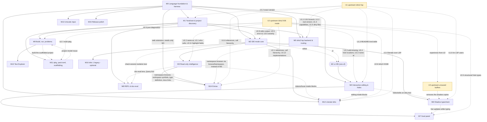

# vscode-idris2 — roadmap

Status: final planning document, 2026-09-23. Extension `vscode-idris2` (id
`etairi.vscode-idris2`), display name "Idris 2", publisher `etairi` (provisional, §9).
Companion documents: `landscape.md` (the verified survey and source of truth for everything it
covers) and `ARCHITECTURE.md` (the technical design that every milestone below is built to).

How to read this file. Milestones **M0–M16** are extension increments: after each one the
extension installs, activates and works, and everything that worked before still works.
**U1–U3** are upstream work in `idris2-lsp` or the Idris 2 compiler; the extension never
depends on them shipping. Sizes: **S** ≈ a day, **M** ≈ several days, **L** ≈ 1–2 weeks of
focused work by one developer with an AI assistant. Dependencies are the *minimum* needed;
"M2 or M5" means either backend suffices. **The user chooses the implementation order; any
order that respects the dependency graph in §4 is valid.**

Evidence tags, as in `landscape.md`: **[live]** run on this machine (macOS arm64, Homebrew
`idris2` 0.8.0, Node 24) during the planning session; **[src]** read in the named checkout
(`idris2-lsp` `9a2f0ad` 2026-08-01, Idris2 master `1c630e6` 2026-09-08); **[doc]** from a
README/spec; **[gh]** a GitHub issue reference — all eleven were fetched on 2026-09-25 and their
titles and bodies match the descriptions given here; every one was still open on that date;
**[open]** not verified — listed again in §9.

---

## 0. Facts established beyond `landscape.md`

Everything below was re-verified in this session unless the tag says otherwise. The design and
the milestones cite these as F1…F36. Reproduction: a 60-line Node driver that spawns
`idris2 --ide-mode --no-color` (or `--ide-mode-socket`), frames each request with the 6-hex
byte length, and prints frames until `:return`; fixtures are quoted inline. M2's e2e suite turns
every row into a regression test. F29–F36 were added during the adversarial review of this
document (the reviewers' runs were reproduced independently before being recorded).

| # | Fact | Tag |
|---|---|---|
| F1 | The 6-hex length prefix counts **UTF-8 bytes** including the trailing newline. `((:interpret "\"→\"") 1)` framed by bytes → `(:return (:ok "\"\\226\\134\\146\"" …) 1)`; framed by code points → `Parse error … Expected ')'` tagged id 0, and every later request fails the same way. Confirms landscape §4.3; the protocol rst's "characters" is wrong for non-ASCII. **Addendum (M0, 2026-09-27): this holds for requests only.** The compiler reads a request one byte per `Char`, so non-ASCII request text arrives as Latin-1 (`((:bogus "é") 4)` is echoed as `"é"`), while it prefixes each **reply** with its length in **code points** (`send` pads `length r` of an Idris `String`): a `:docs-for` reply containing `→` and `𝕟` had prefix `0000ff` = 255 = its code points including the newline, against 260 UTF-8 bytes and 256 UTF-16 units. First found by the fake-compiler work (`test/fake-idris2/README.md`, which also covers NUL truncation). | [live] + [src v0.8.0 `Idris/IDEMode/Commands.idr` 41–47] |
| F2 | **Coordinates.** `:type-of NAME L C` takes a **1-based line and 0-based column with inclusive end**: for `xs` at 0-based columns 5–6 of line 8, columns 4 fails, 5 and 7 succeed, line 7 fails. **Correction (M0, 2026-09-27): `:case-split L C NAME` takes a 1-based column**, and `C = 0` means anywhere on line L. The column need not be on NAME: on `vlen xs = ?vlen_rhs` (line 8) `:case-split 8 C "xs"` succeeds for C = 0, 1, 4–8, i.e. anywhere from the start of the line to the inclusive end of the left-hand side `vlen xs` (0-based end 7), and fails for 9 (the `=`), while `:type-of "xs" 8 C` succeeds for 5–7 only [live]; `processEdit (CaseSplit …)` tests `within (line-1, col-1)` / `onLine`, `TypeAt` tests `within (line-1, col)` [src `Idris/REPL.idr` 488–494 / 466 on v0.8.0]. `:generate-def L NAME` takes the line of the *type declaration*. Replies (`:warning`, `:name-at`, `:highlight-source`) are **0-based, end-exclusive**. `(:name-at "vlen_rhs")` (unqualified) → `(("Clean.vlen_rhs" (:filename "<abs>") (:start 7 10) (:end 7 19)))`; the qualified form returns `()`; `(:name-at NAME L C)` is a stub. | [live] + [src] |
| F3 | Eleven IDE commands are `todoCmd` **stubs** on 0.8.0 and on master: `name-at <name> <line> <col>`, `add-missing`, `apropos`, `directive`, `who-calls`, `calls-who`, `normalise-term`, `show-term-implicits`, `hide-term-implicits`, `elaborate-term`, `print-definition`. Each prints `(:write-string "<cmd>: command not yet implemented. Hopefully soon!")` then returns an empty `:ok`. **Corrects landscape §5 gap 2 ("C already done")** and **gap 7 ("`add-missing` only in IDE mode")**. | [live] + [src `Idris/IDEMode/REPL.idr` 155–227] |
| F4 | Unparseable requests are answered `(:return (:error "Unrecognised command: …") <previous id>)`. `cd` is **not** a command (`Protocol/IDE/Command.idr` has no case; `(:cd "/tmp")` is "unrecognised") — **corrects landscape §4.3**. `version`, `proof-search-next`, `generate-def-next` are **bare symbols**: send `(:version 7)`, not `((:version) 7)`. | [live] + [src `Command.idr` 99, 102] |
| F5 | Over **stdio**, `(:interpret ":exec putStrLn \"hi\"")` writes `hi\n` **unframed** into the protocol stream. Over `idris2 --ide-mode-socket` the process prints a port on stdout, the same output goes to the *process* stdout and the socket stream stays framed. On stdin EOF stdio mode emits the unframed tail `Alas the file is done, aborting`. **Addendum (M0, 2026-09-27):** that tail and exit 1 come when input ends at a request boundary; when it ends one read into a request (an unframed line without its newline, a 5-byte tail, a frame one byte short) the process exits 0 silently without answering it (C stdio's one read past EOF; `test/fake-idris2/README.md`). Over the socket (macOS arm64; Linux not tried), a request that arrives in the same read as an earlier one is dropped unanswered (`(:version 1)` and `(:version 2)` in one write → one reply; the socket `FILE` is `fdopen`ed `r+` and shared by reads and replies) — another reason for ARCHITECTURE §5's one request in flight. | [live] + [src v0.8.0 `Idris/IDEMode/REPL.idr` 42–115, 462–476] |
| F6 | Load errors arrive as `(:warning (FILE (L C) (L C) MSG HL) ID)`: FILE **relative to the process cwd**, positions 0-based end-exclusive (`(2 0) (2 14)` ↔ `Part:3:1--3:15`), MSG = message, blank line, `Mod:l:c--l:c`, source excerpt, and a `Missing cases:` block for coverage errors; then `(:return (:error "Error(s) building file …") ID)`. | [live] |
| F7 | **No severity field.** A warning-only load (`Unreachable clause: f n`) sends one `:warning` frame and then `(:return (:ok ()) ID)`; a load with a warning and an error sends both as `:warning` frames then `:error`. Reloading a file whose TTC is fresh emits **no** `Building` write-string and **no** `:warning` frames, but **does** re-emit the `:highlight-source` frames. | [live] |
| F8 | **Shadow typecheck of an unsaved copy.** Copy `Foo/B.idr` (with a new `?arg`) to `<shadow>/Foo/B.idr` where no `.ipkg` exists above; spawn with cwd `<shadow>`, env `IDRIS2_PATH=<proj>/build/ttc` (the directory *containing* the TTC-version directory), `--build-dir <shadow>/build`; `:load-file "Foo/B.idr"` → `Building Foo.B`, `(:ok ())`, `:metavariables` lists `Foo.B.arg`, and every file under `<proj>/build/ttc` keeps its mtime. Without `IDRIS2_PATH`, or with it pointing at the version subdirectory, → `Module Foo.A not found`. | [live] |
| F9 | `idris2 --check` exit codes: 1 for a type error and for a coverage error, **0 for `Module Nope.Thing not found`**; `--typecheck`/`--build` of a clean ipkg exit 0. Qualifies landscape §4.2. | [live] |
| F10 | `.ipkg` parse errors: `idris2 --dump-ipkg-json bad.ipkg` prints `Error: Unrecognised property "pkgs".` then `"bad.ipkg":3:1--3:5` and a snippet, exit 1 (same shape for a trailing comma: `Expected end of file.`). In IDE mode a malformed `.ipkg` in the cwd chain turns `:load-file` into `(:return (:error "<the same text>"))` with **no** `:warning` frame. With several `.ipkg` files in one directory the compiler picks one of them. **Addendum (M1, 2026-09-27): which one.** `findIpkgFile` lists each directory with `listDir` and takes `find (\f => extension f == Just "ipkg")` of the names, unsorted, stopping (with nothing) at a directory it cannot list [src v0.8.0 `Core/Directory.idr` 333–349]; so the first `.ipkg` in the order the file system lists the directory wins. On APFS, in a directory whose `ls -f` order was `c.ipkg b.ipkg d.ipkg X.idr a.ipkg`, `idris2 --find-ipkg --check X.idr` read `c.ipkg` [live, M1 project work]; other file systems and Windows not tried. Node's `fs.readdir` sorts names, `fs.opendir` keeps that order (`project/ipkg.ts`). | [live] + [src] |
| F11 | **Literate positions.** `.lidr` (bird tracks): all reply columns are *unlit* columns (`> module Lit` reports `module` at (0 0)–(0 6); an error under `> g = "x"` reports (5 4)–(5 7) for file columns 6–9), and requests expect unlit columns too (`(:type-of "n" 6 2)` succeeds for `n` at file column 4). Lines are file lines even with prose lines in between. Edit replies come back **with** `> ` (`> f 0 = ?f_rhs_0`, `> h k = ?h_rhs`, make-lemma `definition-type` `> f_rhs : Nat -> Nat`; `replace-metavariable` unprefixed). `.md` (fenced): lines and columns exact, replies plain. Added in M0 (2026-09-27): `:case-split` in a `.lidr` takes 1-based *unlit* columns (`> f n = ?f_rhs` on line 6: C = 1–4 succeed, 5–6 fail), and the CLI text of `idris2 --check` is unlit too (an error under `> g = "x"`, file columns 6–9, is reported `Err:6:5--6:8`). Added in M0 review: **the compiler picks the literate style by file name, and a CRLF break in a `.lidr` joins two lines.** `isLitFile` is a case-sensitive suffix test (`src/Parser/Unlit.idr`): a bird-track `Up.LIDR` fails at its first `>` (1:1). `reduce` in `src/Libraries/Text/Literate.idr` (same on master) keeps a newline token only when it is exactly `"\n"`: `> g : Nat\r\n> g = 1` fails with `Undefined name Natg`, an all-CRLF `.lidr` with `Couldn't parse declaration` at 1:14; the same text with LF, and a CRLF `.idr`, pass. Hence `"files.eol": "\n"` in the `[lidr]` defaults (`files.eol` is language-overridable: `scope: 6` in VS Code 1.139.1's workbench bundle, the `language-overridable` value). **Addendum (M1 review, 2026-09-27): case folding.** On the development machine's case-insensitive APFS volume, `idris2 --check Main.idr` with `import Up` and only a file `Up.IDR` beside it printed `1/2: Building Up (Up.idr)` and exited 0: the compiler opens `<dir>/Up.idr`, and the file system resolves that name to `Up.IDR`. `project/index.ts` compares names case-sensitively, as the compiler's name tests do, so `pathToModule` gives `Up.IDR` no module name (M1 As built, *Modules ↔ paths*). | [live] + [src] |
| F12 | `--build-dir build/.vscode-idris2` with an auto-discovered ipkg writes TTCs under that directory — **unless the ipkg has a `builddir` field, which overrides the flag** (TTC went to `out/`). | [live] |
| F13 | `:load-file` calls `findIpkg`, which walks **up from the process cwd**, `changeDir`s to the ipkg directory and applies `sourcedir`/`depends`/`builddir`/`opts`. From the ipkg directory both `src/Foo/B.idr` and its absolute path load; from a foreign cwd both fail (`Module Foo.A not found`), also with `--find-ipkg`; from `src/Foo`, `B.idr` loads without `--find-ipkg` but fails with it (`Source file "B.idr" is not in the source directory`). | [live] + [src `Idris/Package.idr` 1093–1110, `IDEMode/REPL.idr` 143–147] |
| F14 | `((:enable-syntax :False) 1)` → `"Syntax highlight option changed to False"`; the following load emits **zero** `:highlight-source` frames (31 without it for an 8-line file). | [live] |
| F15 | `(:interpret ":missing g")` → `"Part.g:\ng (S _)"`; `(:interpret ":printdef g")` works; `:case-split` on a clause whose right-hand side is **not a hole** (`f n = n`) answers `No clause to split here` on a plain `.idr` too. | [live] |
| F16 | After a load that ended in `(:return (:error …))` (coverage error in `g`), `(:type-of "main" 7 0)` and `(:type-of "main")` still answer `Part.main : IO ()`. Plan-proof-ux's report that position-based commands fail with misleading messages after an errored load was **not reproduced** on this fixture; it is kept only as a fallback rephrasing rule. | [live, one fixture] |
| F17 | `@vscode/test-cli` 0.0.15 failed with `listen EINVAL … .vscode-test/user-data/1.13-main.sock` when the user-data-dir path exceeded the Unix socket limit (103 characters) — run tests from a short path or with a short `--user-data-dir`. | [live: `gen-test.log`] |
| F18 | **Unicode in source.** `--check` accepts identifiers `α`, `x₁`, `ℕ` (exit 0) and rejects `→` as arrow, `λ` as lambda and a Unicode operator `∘∘` (exit 1). | [live] |
| F19 | `idris2 --mkdoc proj.ipkg` writes `build/docs/index.html`, `build/docs/docs/<Module>.html` with anchors `id="Foo.A.shout"` / `href="Foo.A.html#Foo.A.shout"`. | [live] |
| F20 | `idris2-lsp --version` prints `Idris2 LSP: <server version>` and `Idris2 API: <compiler version>` (exact rendering untested); `serverInfo.version` is the constant `"0.1"`; `processSettings` reads the option keys from the **top level** of the JSON it is given (`initializationOptions` and `didChangeConfiguration.settings`); `loadURI` requires `PostSession`, `changeDir`s to the file's folder, needs `findIpkg` (`Cannot find the ipkg file` otherwise) and reads the file from disk; handlers exist for `repl`, `metavars`, `exprSearchWithHints`, `refineHole`, `browseNamespace` while `refineHoleWithHints` is advertised; `references`/`rename`/`workspaceSymbol` are `false`, semantic tokens `range = false`, `full = true`. **Addendum (M1, 2026-09-27): the rendering, from source.** Both lines are `show` of a `Version`, i.e. `showVersion True`: `<major>.<minor>.<patch>`, then `-<tag>` when the tag is not empty [src v0.8.0 `Libraries/Data/Version.idr` 26–38, `Idris/Version.idr`]. The tag is the Makefile's `VERSION_TAG`, which defaults to `git rev-parse --short=9 HEAD` when the build runs in a git checkout at an untagged commit, else is empty [src: Idris2 `Makefile` 19–27, 79–83; idris2-lsp `Makefile` 8–20, 58]; so a server built from `9a2f0ad` in a checkout prints `Idris2 LSP: 0.1.0-9a2f0ad6a`. Any argument list other than `["--version"]` (and `[]`, which starts the server) prints `Invalid Arguments` on stdout and exits 0 [src `Server/Main.idr` 211–218]. Still no server was run. | [src `Server/Main.idr` 206–218, `Capabilities.idr`, `ProcessMessage.idr`] |
| F21 | idris2-lsp `main` (`9a2f0ad`) pins the Idris2 submodule at `6ca00e7`; `PostSession` occurs 4× in master `IDEMode/REPL.idr` and 0× in the v0.8.0 copy of that file (local copy fetched by a planning agent; provenance not re-verified). Inference: idris2-lsp `main` does not build against the release 0.8.0 API; no `idris2-0.8.0` branch exists [landscape §3]. Build not attempted. | [src] + [inference] |
| F22 | pack layout: user config `$XDG_CONFIG_HOME/pack/pack.toml`, installs under `$XDG_STATE_HOME/pack/install/<collection>/…` with binaries in `…/bin` and wrappers in `~/.local/bin`; `pack install-app idris2-lsp`, `pack switch <collection>`, `pack new lib|bin <name>`, `[custom.all.<pkg>]` entries. The `nightly-260924` collection pins `[idris2] version = "0.8.0", commit = 1c630e6…` (i.e. master labelled 0.8.0) and `[db.idris2-lsp] commit = 9a2f0ad…`, so pack keeps compiler and server in lock-step. **Corrections (M1, 2026-09-27), from pack's source at `6baee7d`:** the collection chosen by `pack switch` is written to **`<state>/pack.toml`**, not to the user's `$XDG_CONFIG_HOME/pack/pack.toml`, and overrides it (`collectionToml = MkF pd.state packToml`, `writeCollection`, `foldl update … (global::collToml::local)`, `src/Pack/Config/Environment.idr` 65–66, 449–457, 474–487, 695–702); `PACK_USER_DIR`, `PACK_STATE_DIR` and `PACK_BIN_DIR` replace the config, state and bin (`~/.local/bin`) directories (`getPackDirs`, 313–350); installs are keyed by the **compiler commit**, `<state>/install/<idris2 commit>/…` (`commitDir`, 133–134), not by the collection, and no code writes the README's `install/<collection>/bin`; the `idris2`/`idris2-lsp` in `~/.local/bin` are `sh` wrappers that run `pack app-path <app>` (and, for `idris2`, `package-path`, `libs-path`, `data-path`) on every run and then the binary as their child (`appLink`, `src/Pack/Runner/Install.idr` 139–188, 324). **These runs can reach the network** (traced in the M1 review): every configured command, `app-path` and the path queries included, first runs `getConfig`, whose `defaultColl` fetches the package database with git when `<state>/db` is missing (`when !(missing dbDir) updateDB`, `Environment.idr` 386–389, `updateDB` 354–359); and `env` resolves meta commits with `resolveMeta (fetch > MissingOnly)` (672–673), where a commit written `fetch-latest:<branch>` always runs `git ls-remote` and one written `latest:<branch>` does so when its commit file is missing (`FromString MetaCommit`, `src/Pack/Database/Types.idr` 35–39; `resolveMeta`, 396–413; `gitLatest`, `src/Pack/Core/Git.idr` 49–51). pack is still not installed here (§9 Q2). | [doc: pack README, pack-db collection file] + [src: idris2-pack `6baee7d`] |
| F23 | ipkg fields accepted by master's parser: `package`, `version`, `langversion`, `authors`, `maintainers`, `license`, `brief`, `readme`, `homepage`, `sourceloc`, `bugtracker`, `depends`, `modules`, `main`, `executable`, `opts`/`options`, `sourcedir`, `datadir`, `builddir`, `outputdir`, `prebuild`, `postbuild`, `preinstall`, `postinstall`, `preclean`, `postclean`. `--dump-ipkg-json` emits `name`, `depends` (with bounds), `modules`, `version`, `authors`, `main`, `executable`, `sourcedir` [live]. **Addendum (M1, 2026-09-27):** string values are printed raw (`toJson str = "\"\{str}\""`, and an ipkg string literal keeps its escapes): `sourcedir = "src\\main"` is printed as `"src\\main"`, which `JSON.parse` would decode to a different value, and a newline inside a literal is printed raw, which is invalid JSON; a deprecation warning (`version = "0.1"`) is printed on stdout before the JSON; errors go to stderr with exit 1 [live, M1 project work, recorded in `test/unit/support/ipkgRecordings.ts`]. A module's source is looked for with the literate extensions before `.idr` (`listOfExtensionsStr`): `Twice.md` beside `Twice.idr` is the module's source [live: `Building Lit.Twice (src/Lit/Twice.md)`]. | [src `Idris/Package.idr` 80–206] + [live] |
| F24 | `Test.Golden` (shipped as source in the Homebrew `test` package): a test is a directory with `run` (shell script taking `$1` = executable under test) and `expected`; the compiled runner is invoked `runtests <path-to-executable> [--timing] [--interactive] [--[no-]color] [--cg CG] [--threads N] [--failure-file P] [--only-file P] [[--only\|--except] NAMES]`; failures are shown with `git diff --no-index … expected output`. Output format for machine parsing [open]. | [src `test-0.8.0/Test/Golden.idr`] |
| F25 | `-p contrib` makes a loose file's `import Data.String.Extra` resolve from a cwd without an ipkg; without it → `Module Data.String.Extra not found`. `idris2 --client ':t id'` answers one-shot. `idris2 --version` → `Idris 2, version 0.8.0`. | [live] |
| F26 | LSP `metavars` premises carry `location`, `name`, `type`, `isImplicit` **and** `multiplicity` (the last is absent from `doc/commands.md`). | [src `Language/LSP/Metavars.idr` 38–41] |
| F27 | `(:interpret ":set showimplicits")` persists across a later `:load-file`: `(:get-options)` reports `(:show-implicits :True)` and `:type-of vlen` then shows `{0 a : Type} -> {0 n : Nat} -> …`. Session state is mutable. | [live] |
| F28 | idris2-lsp quick fixes are all built by `buildQuickfix`, whose title is **`QuickFix: <msg>`** with `kind = QuickFix`, `isPreferred = True` and the triggering diagnostic attached; the `<msg>` values are `Add missing cases` (inserts `<clause> = ?<fn>_missing_case_<k>` lines, k from 1, at the first blank line after the declaration), `Unify pattern names`, `Remove impossible keyword`, `Add partial annotation`, `Add covering annotation`, `Replace with <name>`. A client selects a fix by `kind == quickfix` plus the attached diagnostic, never by the bare message. Compiler warning constructors on master: `ParserWarning`, `UnreachableClause`, `ShadowingGlobalDefs`, `IncompatibleVisibility`, `ShadowingLocalBindings`, `Deprecated`, `GenericWarn`. | [src `Server/QuickFix.idr` 52–58, 87–133; `Core/Core.idr` 70–87] |
| F29 | **`:intro`, `:refine`, ambiguity.** On `f n = ?f_rhs` (line 4, 1-based) `((:intro 4 "f_rhs") id)` → `(:ok ("0" "S ?f_rhs_0"))` (a list of candidate strings); `((:refine 4 "f_rhs" "S") id)` → `(:ok "S ?f_rhs_0")` (one string). Refining `?g_rhs` with a name defined in two namespaces → `(:error "Ambiguous elaboration. Possible results:\n    Q.A.foo ?g_rhs_0\n    Q.B.foo ?g_rhs_0\n\n(Interactive):1:1--1:4\n 1 \| module Q\n     ^^^\n" HL)` — the alternatives are the indented lines between `Possible results:` and the blank line; the `(Interactive)` location tail is noise. Both commands take a 1-based line, as `:add-clause` does (F2). | [live, `verify-probe/P.idr`, `Q.idr`] |
| F30 | **`:generate-def(-next)`, `:proof-search(-next)` reply shapes.** On `Clean.idr` (`append : Vect n a -> Vect m a -> Vect (n + m) a` on line 5, `vlen xs = ?vlen_rhs` on line 8): `((:generate-def 5 "append") id)` → `(:ok "append [] ys = ys\nappend (x :: xs) ys = x :: append xs ys")` — **one multi-line string**; `(:generate-def-next id)` → the 3-clause alternative `append [] ys = ys / append (x :: xs) [] = … / append (x :: xs) (y :: ys) = x :: append xs (y :: ys)`, a second `-next` → the same clauses with `y :: append xs (x :: ys)`. `((:proof-search 8 "vlen_rhs" ()) id)` → `(:ok "0" ((0 1 ((:decor :data)))))`, `(:proof-search-next id)` → `"1"`, then `"2"` — the reply carries **highlight metadata after the string**, which the decoder must skip. `((:type-of "xs" 8 5) id)` → `(:ok "xs : Vect ?_ ?_" ((5 4 ((:decor :type)))))`. Strikes the "not exercised live" caveat of landscape §4.3 for these commands. | [live, `verify-probe/Clean.idr`] |
| F31 | **Mode flags are parsed and ignored.** `(:proof-search L NAME HINTS :all)` returns exactly what the form without `:all` returns (`"0"`); `(:docs-for "id" :full)`, `(:docs-for "id" :overview)` and `(:docs-for "id")` return byte-identical replies (`Prelude.id : a -> a\n  Identity function.\n  Totality: total\n  Visibility: public export` with spans); `((:load-file "Q.idr" 3) id)` behaves exactly like `(:load-file "Q.idr")` — the LINE argument is dropped, so "check up to cursor" is **not** available via IDE mode. Source: `process (ExprSearch l n hs all)` never uses `all`, `process (DocsFor n modeOpt)` ignores `modeOpt`, `process (LoadFile fname_in _)` drops the line, on master and in the 0.8.0 copy. Closes E4. | [live] + [src `IDEMode/REPL.idr` 143, 184–186, 198–199; `v080-IDEMode-REPL.idr` 145, 185, 200] |
| F32 | **Shadow `IDRIS2_PATH` under build-dir isolation.** `idris2 --build-dir build/.vscode-idris2 --typecheck probe.ipkg` creates only `build/.vscode-idris2/ttc/2025081600/Foo/`; `build/ttc` does not exist. From a shadow copy of `Foo/B.idr` (no ipkg above it), `IDRIS2_PATH=<proj>/build/ttc idris2 --build-dir $PWD/build --check Foo/B.idr` → `Error: Module Foo.A not found` (exit 0, F9), whereas `IDRIS2_PATH=<proj>/build/.vscode-idris2/ttc …` → `1/1: Building Foo.B`. So the shadow session must import from the *effective* check build directory (D5), not from `<root>/build/ttc` as F8's fixture (which had no isolation) suggested. | [live, `verify-ttc/`] |
| F33 | **`:highlight-source` carries no types or docs.** Every frame of a load on 0.8.0 has `(:doc-overview "")` and `(:type "")` (e.g. `((:name "xs") (:namespace "") (:decor :bound) (:implicit :False) (:key "") (:doc-overview "") (:type ""))`); master hard-codes both to `""` (`docOverview = "" --!(getDocsForName fc nm)`, `typ = "" -- TODO`). `:namespace` is `""` for bound names and for the type-declaration occurrence of `vlen`; only the definition-line occurrence carries `"Clean"`. Hover/inlay types must therefore come from positional `:type-of NAME L C` (F2, F30) and docs from `:docs-for`; the index supplies name, decor and span only. | [live, `verify-probe/hl.mjs`] + [src `IDEMode/SyntaxHighlight.idr` 50–59] |
| F34 | **idris2-lsp code actions, from source (the README's kind table is stale).** Kinds accepted as `context.only` keys: `refactor.rewrite.{AddClause,CaseSplit,ExprSearch,GenerateDef,GenerateDefNext,Intro,MakeCase,MakeWith,RefineHole}` and `refactor.extract.MakeLemma` — **`MakeClause` does not exist** (README line 78 vs `AddClause.idr` 38) and `GenerateDefNext` is missing from the README. Each action module checks `only` itself (`isAllowed`: its own key **or** the generic `refactor.rewrite`/`refactor.extract`; absent `only` ⇒ allowed), so the server does honour `only`; the top-level handler only gates quick fixes. But every **returned** action has the *generic* kind (`kind = Just RefactorRewrite`, MakeLemma `RefactorExtract`), so actions must be told apart by **title**: `Case split on ?<n>`, `Add clause`, `Make lemma for hole ?<n>`, `Make with for hole ?<n>`, `Make case for hole ?<n>`, `Expression search on <n> as ~ <str> ...` (up to `maxCodeActionResults`, default 5), `Intro <str> over hole <n>` (**one action per candidate**), `Generate definition #<i> as ~ <lastLine> ...`, `Generate next definition`, `Refine hole on <n>` (only via `executeCommand refineHole`; an `EditError` such as ambiguity is logged and yields **no action** — ambiguity is not surfaced). | [src `Language/LSP/CodeAction/*.idr` (kind/title/isAllowed lines), `Server/ProcessMessage.idr` 432–449, `Server/Configuration.idr` 90] |
| F35 | **The server never tells the client about a missing ipkg.** `loadURI` returns `Left "Cannot load ipkg file for <uri>: \"Cannot find the ipkg file\""` and calls `logE Server msg`, which writes `LOG Error:Server: …` to the log handle (stderr by default, or `logFile`). The `didOpen`/`didSave` handlers call `ignore $ loadURI …`; there is no `window/showMessage` or `window/logMessage` anywhere in `src/Server`. The text reaches the client only as a `ResponseError` with code `Custom 3` from `withURI` when a later request forces a reload — and since `loadURI` sets `openFile := Just (uri, version)` *before* the ipkg check fails, `loadIfNeeded` treats version-less requests for that file as already loaded and returns `Right ()`, so even that path is not guaranteed. | [src `Server/ProcessMessage.idr` 209, 221–224, 276–282, 292–297, 576, 589; `Server/Log.idr` 78–82; `Server/Configuration.idr` 82] |
| F36 | Bamboo's contributed setting is `idris2-lsp.loglevel` while the server option (and what bamboo's own `extension.ts` reads) is `logSeverity`; the other seven server options are contributed under their server names (`logFile`, `longActionTimeout`, `maxCodeActionResults`, `showImplicits`, `showMachineNames`, `fullNamespace`, `briefCompletions`), plus `path` and `trace.server`. pack's documented install command is `bash -c "$(curl -fsSL https://raw.githubusercontent.com/stefan-hoeck/idris2-pack/main/install.bash)"`. | [src `idris2-lsp-vscode/package.json` 74–126, `src/extension.ts` 59] + [doc pack README line 26] |

**Corrections to `landscape.md`** (applied to that file in place on 2026-09-25 — see its §8
"Corrections log", which also records which items were re-verified independently; the list is
kept here for the record, and the survey stays the source of truth for everything else):
gap 2's "C already done" for `who-calls`/`calls-who` is wrong (F3); gap 7's "`add-missing` only
in IDE mode" is wrong — it is a stub everywhere, `:missing` via `:interpret` is the working
substitute (F3, F15); §4.3 lists `cd` as a command — it is not (F4); §4.2's "exit code 1 on
error" does not hold for a missing module under `--check` (F9); §1's "no `~/.pack`" is not
evidence about pack any more (XDG paths, F22) though the conclusion (pack absent) stands;
§3's code-action list names `MakeClause` and omits `GenerateDefNext` — the real kinds are in
F34 (the landscape row was copied from the server README, which is stale relative to the
code), and its "Filter keys (`context.only`)" are exactly that — filter keys — while the
returned actions carry only the generic `refactor.rewrite`/`refactor.extract` kind (F34);
§4.3's "not exercised live" caveat no longer applies to `intro`, `refine`,
`generate-def(-next)` and `proof-search-next` (F29, F30) — it still applies to `who-calls`,
`calls-who`, `add-missing` and positional `name-at`, which are stubs anyway (F3).

---

## 1. Purpose, vision, design principles

**Purpose.** A comprehensive, maintained Visual Studio Code extension for Idris 2 (0.8.0 and
current master), built incrementally by one developer, that works with nothing but the `idris2`
binary and becomes richer when `idris2-lsp` is present.

**Vision.** Make VS Code the most pleasant place to write Idris 2: errors, types and holes
appear without ceremony, the hole under the cursor is always one glance away (the Lean 4
InfoView the user relies on daily), interactive editing — case split, proof search, generate
definition, refine, with alternatives you can cycle — is one keystroke away, literate documents
(Markdown, LaTeX) are first-class, and the toolchain explains itself.

**Design principles.**

1. **Zero-setup value first.** Everything the compiler's IDE protocol can do works with a stock
   `idris2` and no `.ipkg`. The language server is an upgrade, never a prerequisite.
2. **Two backends, one feature surface.** Features are written against `IdrisBackend`;
   `idris2-lsp` and IDE mode implement it; the router picks per project root and falls back per
   feature.
3. **The compiler is the source of truth.** No regex "semantics" (definition, references,
   rename) presented as compiler results; syntactic heuristics are labelled as such.
4. **Never lie about state.** Results say whether they come from the saved file, the unsaved
   shadow copy, or a build; the status item names the backend and versions in use.
5. **Never corrupt the checking session.** Socket transport, a separate evaluation session,
   isolated build directories where the compiler allows it.
6. **Verified facts only.** Every protocol behaviour the code relies on is pinned by a test
   replaying frames recorded from a real compiler; nothing is assumed about upstream behaviour
   that was not observed.
7. **Small, shippable increments** with explicit, minimal dependencies; risky mechanisms
   (shadow typecheck, webview) are separate milestones with an off switch.
8. **Local and private.** No telemetry, no network calls; installs and builds run as visible
   terminal commands the user starts.

---

## 2. Architecture summary

The extension has three engines behind one interface (`ARCHITECTURE.md` §3–§4). The **IDE-mode
backend** drives `idris2 --ide-mode-socket` (stdio as a fallback) through a per-project-root
pool of sessions with distinct roles — `check` for loading saved files and answering
type/hole/edit requests, `eval` for `:interpret` so that `:set`/`:exec` side effects never
touch checking state (F5, F27), and `shadow` for unsaved buffers (F8). Each session is a small
state machine with one request in flight, per-request timeouts that kill and respawn (the
protocol has no cancel), attribution of the compiler's previous-id quirk (F4), byte-length
framing of requests and code-point-length reading of replies (F1), and a tolerant frame
reader. The **LSP backend** wraps one `vscode-languageclient` 10.x client per window and
enforces per-root ownership through middleware, so a root can switch backend at runtime;
server options are forwarded as the flat object `processSettings` reads (F20). The **CLI
runner** executes one-shot `idris2`/`pack` commands for versions, `.ipkg` JSON, builds and
runs, and never trusts exit codes alone (F9).

All coordinate conversions live in `core/positions.ts` (`ARCHITECTURE.md` §7): 1-based request
lines with 0-based inclusive columns (1-based for `:case-split`), 0-based exclusive reply
positions, 1-based CLI text, and
the bird-track column offset that `.lidr` files need in both directions (F2, F11). Diagnostics
come from three collections (saved, unsaved, build) with a severity rule derived from the
`:return` kind and a known-warning table (F7), and `.ipkg` parse errors are mapped onto the ipkg
file (F10). Holes are one model with two views: a tree view for navigation and a webview goal
panel for the Lean-like display (`ARCHITECTURE.md` §9).

Testing is layered so that CI needs no compiler: unit tests on the codecs and decoders,
integration tests in the Extension Host driven by a fake compiler and a fake LSP server that
replay recorded transcripts, and an e2e suite against the real toolchain that is also the
recorder of those transcripts (`ARCHITECTURE.md` §12–§13).

---

## 3. Milestone overview

| id | title | size | depends on | upstream? | gaps closed (landscape §5) |
|---|---|---|---|---|---|
| M0 | Language foundation and engineering harness | M | — | no | 13; 5 (syntactic folding and selection ranges) |
| M1 | Toolchain and project discovery | M | M0 | no (U1.2 improves) | 8 (locate, verdict, guided install); groundwork for 4, 11 |
| M2 | IDE-mode core: transport, session, diagnostics | L | M0, M1 | no (U2.5, U2.8, U2.9 improve) | 4; 1 and 3 (mitigations) |
| M3 | Read-only intelligence over IDE mode | M/L | M2 | no (U2.1, U2.2, U2.11 improve) | 9 (inline evaluation); 2 (global definitions); 5 (inlay hints, IDE mode); 14 (browser) |
| M4 | Interactive editing and holes | L | M0 and (M2 or M5); see the M2-only/LSP-only acceptance split | no (U2.2–U2.4, U1.3 improve) | 7; 6 (tree view) |
| M5 | idris2-lsp backend and routing | M | M0, M1 | no (U1 improves) | 8 (rest); 7 (server side); 1, 3 (mitigations) |
| M6 | Check-while-typing: shadow typecheck | M | M2 (M4 optional) | no (U3 replaces) | 1 |
| M7 | Goal panel (webview) | L | M4 (M6 optional) | no (U2.4 improves) | 6 (complete) |
| M8 | REPL terminal and doc-eval | S/M | M1 (M3 optional: doc-eval lens, Query box; M2 optional: check-session isolation test) | no | 9 (rest) |
| M9 | Build, run and problem reporting | M | M1 (M11 optional: project model reuse) | no (U2.5 improves) | 10 (all but tests) |
| M10 | Test Explorer for `Test.Golden` suites | S/M | M9 | no | 10 (rest) |
| M11 | `.ipkg`, `pack.toml` and project scaffolding | M | M1 (M9 optional: build the scaffolded project) | no (U2.7 improves) | 11 |
| M12 | Literate Idris beyond `.lidr` | M/L | M0, M2 (M3, M4 optional) | server side → U1.4, compiler → U2.6 | 12 |
| M13 | Unicode input method | S/M | M0 | no | 14 (input) |
| M14 | Extras: namespace browser, workspace symbols, type-definition heuristic, docs links, web extension | S each | M3 (or M5); web extension: M0 | no (U1.6, U2.1, U2.12 improve) | 14; 2 (partial) |
| M15 | Release polish and publishing | S | M0 (realistically after M0–M4) | no | — |
| M16 | Idris 1 legacy support (optional, **not recommended**) | L | M2 | no | 14 (Idris 1) |
| U1 | Upstream: idris2-lsp | external | — | **yes** | 1, 2, 3, 5, 8, 12 (server side) |
| U2 | Upstream: Idris 2 compiler IDE mode | external | — | **yes** | 2, 5, 6, 7, 12 (compiler side) |
| U3 | Upstream: unsaved-buffer checking (compiler + server) | external | U2 experience | **yes** | 1 (real fix) |

Sizes M/L mean "M if the optional sub-items are left out, L with them" (M3: inlay hints and the
`eval` session; M12: the three [open] position models and bare-`.md` content detection).

---

## 4. Dependency graph

Solid arrows are hard dependencies; dotted arrows are optional enhancements or upstream
enablers and never block. The hexagon `M2 or M5` is an **OR** node: M4 needs *one* of the two
backends (dotted edges into the hexagon, so that the legend's "solid = AND" reading does not
apply); the M4 acceptance is split accordingly (§5, M4). The graph below is generated by
`scripts/deps-graph.mjs` from `docs/milestones.yaml`, which encodes the per-milestone
"Dependencies" and "Upstream" lines in §5 (and U3's in §6); `npm run docs:graph:check` fails
when the graph, the YAML file or those lines disagree.

<!-- deps-graph:start: generated by scripts/deps-graph.mjs from docs/milestones.yaml; edit that file, then run `npm run docs:graph` -->

<!-- deps-graph:end -->

Each milestone lists at most two *direct* hard dependencies (M4's second one being the OR
node); the longest hard chain from M0 is four steps (M0 → M1 → M2 → M4 → M7, and
M0 → M1 → M2 → M3 → M14).

---

## 5. Milestones

### M0 — Language foundation and engineering harness (M)

- **Goal.** A correct, modern syntax layer for Idris 2 and the engineering skeleton every later
  milestone plugs into — already better than the four existing extensions before any backend.
- **User-visible outcome.** `.idr` (language id `idris2`), `.lidr` (`lidr`) and `.ipkg`
  (`ipkg`) are recognised; highlighting knows `%`-directives (`%default`, `%hint`, `%foreign`,
  `%inline`, `%runElab`, …), `?hole` names as their own scope, `failing` blocks, `\case`,
  `0`/`1` multiplicity binders, `covering`/`partial`/`total`, `export`/`public export`,
  `interface`/`implementation`/`record`/`parameters`/`namespace`/`mutual`,
  `with`/`proof`/`impossible`, `rewrite`, `forall`, string interpolation `"\{…}"`, multi-line
  `"""` and raw `#"…"#` strings, `|||` doc comments, nested `{- -}`; Idris 1's
  `class`/`instance`/`codata`/`dsl`/`syntax` are no longer keywords (landscape §2.1). Comment
  toggling, bracket pairs, indentation folding, **selection ranges** (bracket/indentation-based,
  labelled syntactic — landscape §5 gap 5), a word pattern that includes `?hole`, on-enter
  rules for `where`/`do`/`of`/`= ?hole`; snippets; an "Idris 2" output channel; editor defaults
  for `[idris2]`/`[lidr]` (`editor.semanticHighlighting.enabled: true` so the M3/M5 token
  providers show under themes that leave it at `configuredByTheme` — VS Code default per its
  docs, not re-verified here; `editor.unicodeHighlight.ambiguousCharacters: false` as Lean
  does, so Greek/mathematical identifiers (F18, M13) are not flagged; `editor.tabSize: 2`,
  `editor.insertSpaces: true`); a **Help** command group that needs no backend: **Idris 2:
  Show Output**, **Idris 2: Open Settings**, **Idris 2: Open Idris 2 Documentation** (a static
  URL, user-initiated — principle 8).
- **Scope.** In: grammars for `idris2`, `lidr`, `ipkg` with standard scope prefixes
  (`keyword.control`, `entity.name.function`, `storage.type`, `variable.other.hole`, …) under
  `source.idris2` / `source.idris2.literate` / `source.ipkg`; language configurations;
  `contributes.configurationDefaults`; a `SelectionRangeProvider`; snippets;
  `contributes.semanticTokenTypes` for `module` (superType `namespace`) and `postulate`
  (superType `type`) so the later token providers resolve; `backend/types.ts` + `NullBackend`;
  `project/literate.ts` with the **single document-selector rule** every later registration
  uses — `idrisDocumentSelector()` (a `DocumentSelector` built from the language ids *and*
  literate glob patterns) and `isIdrisDocument(doc)`, plus the `idris2.isIdrisDocument` context
  key it sets on editor change — so that M12 only extends a table instead of retrofitting every
  provider (`ARCHITECTURE.md` §3.2; see "As built" below for the glob patterns);
  `core/positions.ts` implementing the table in `ARCHITECTURE.md` §7 with unit tests encoding
  F2 and F11; the three test layers wired with one test each; `test/fake-idris2` skeleton
  (handshake + `:version`); `.vscode-test.mjs` with an explicit user-data-dir (F17; see "As
  built"); `scripts/deps-graph.mjs` regenerating the §4 graph from `docs/milestones.yaml`; CI
  (ubuntu: lint, types, unit, grammar, integration, `vsce package`; macOS: integration);
  README, CHANGELOG, `.vscodeignore`, licence placeholder. Out: any process spawn; the webview
  (a stub entry only).
- **Technical approach.** Start from meraymond's MIT grammar with attribution or write fresh
  (Q3); rewrite rules by construct; snapshot tests with `vscode-textmate` + `vscode-oniguruma`
  over `test/fixtures/grammar/*.idr`, which are also `idris2 --check`ed in CI so the corpus
  stays valid Idris. `engines.vscode ^1.138.0`, `@types/vscode 1.138.x`, TypeScript 6.x pinned
  (landscape §1), esbuild with two entries, `vscode-languageclient ^10.1.1` declared but unused.
- **Dependencies.** None (assumes the skeleton created by the separate scaffolding task).
- **Acceptance.** Snapshot tests cover every construct listed above; no `keyword.*` scope on
  `class`/`instance`/`codata`/`dsl`/`syntax`; `npm run lint && npm run test:unit && npm run
  test:grammar && npm test` green on ubuntu and macOS; the `.vsix` installs in VS Code 1.139
  and activates on a `.idr` file with no errors in the Extension Host log in < 100 ms;
  `positions.ts` tests pass for the F2/F11 cases; the grammar has a **measured** performance
  budget: E6 records the median of five tokenisation runs of the 2,000-line fixture on the CI
  runner, the test asserts ≤ 2× that median (no absolute number is claimed here — none was
  measured); selection ranges on `vlen (x :: xs) = ?rhs` grow token → parenthesised group →
  clause; the `[idris2]` defaults are applied (`editor.semanticHighlighting.enabled` reads
  `true` in a fresh profile); `isIdrisDocument` is true for `.idr`/`.lidr` and false for a plain
  `.md`.
- **Risks / mitigations.** Grammar work is open-ended → fix the corpus first, iterate; TypeScript
  7 vs `typescript-eslint` → pin TS 6; language-id clash with an installed
  `j-nava.idris2-language-support` (also `idris2`) → README asks to disable it (Q4).
- **Open questions.** Q3 (fork vs fresh grammar), Q4 (language id and scope names).
- **Upstream.** None.
- **As built (2026-09-27).** Where the implementation reads or departs from the text above:
  - *Status: implemented and accepted (2026-09-27).* Committed as `90ce347`; CI run
    36327327811 (on `eb29a8f`, which fixed two socket tests that failed on Windows in run
    36327101720) is green on ubuntu-latest (lint, types, unit, grammar, graph check,
    integration, `vsce package` + artifact, corpus), macos-latest (lint, unit, grammar,
    integration, Homebrew `idris2` + `check:fixtures`) and windows-latest (lint, unit,
    integration) [live]. The 2× CI-median grammar budget is set from those runs (E6: 300 ms).
    The activation time is measured, see *activation time*.
  - *Document selector.* It holds language rows only (`idris2`, `lidr`), not glob patterns.
    The one literate style M0 knows, bird-track `.lidr`, has its own language id, so a
    `**/*.lidr` pattern row would add nothing but a disagreement: it would select a `.lidr`
    file switched to another language mode, which `isIdrisDocument` (keyed on `languageId`)
    rejects. Pattern rows arrive with the first rows that need them, M1's extension table and
    M12's hosts, together with an `isIdrisDocument` that reads the document's path, so that the
    selector and the predicate stay equal.
  - *Literate style in `positions.ts`.* The selector and `isIdrisDocument` follow the language
    mode, but the coordinate conversions follow the file name, as the compiler does
    (`compilerLiterateStyleOf` in `project/literate.ts`, F11): a saved `.lidr` in the `idris2`
    mode still gets the bird-track offset, a `.idr` in the `lidr` mode does not, and an untitled
    document falls back to its language id. Selection ranges stay on the language mode, like
    highlighting.
  - *On-enter `= ?hole`.* Read as "no extra indentation": a line ending in `= ?hole` is a
    complete clause, and VS Code's default (keep the line's indentation) is right for the next
    clause, so no rule exists for it. The rule for a trailing `=` does not fire on it
    (`test/unit/languageConfiguration.test.ts`, case `f x = ?rhs`). The `where`/`do`/`of`
    rules and the others are listed in that test.
  - *User-data-dir (F17).* `.vscode-test.mjs` passes `<checkout>/.vscode-test/user-data`
    explicitly, which is also test-electron's default: 63 characters in the development
    checkout, so the socket path stays under the limit only while the checkout path is short.
  - *Activation time.* The "< 100 ms" is the time **Developer: Show Running Extensions** shows,
    which VS Code 1.139.1 computes as `codeLoadingTime + activateCallTime` [src: its workbench
    bundle] (`docs/checklists/M0.md` step 1). The extension host passes the same
    `activationTimes` object to the workbench (`$onDidActivateExtension`) and to the telemetry
    event `extensionActivationTimes` [src: `extensionHostProcess.js` of 1.139.1], which a
    `--log trace` run writes to `logs/<session>/telemetry.log` when telemetry is enabled.
    Read there for the installed `.vsix` on `Hello.idr` (VS Code 1.139.1, Apple M4, one run
    each, 2026-09-27): **3 ms** on the first launch in a fresh `/tmp/vi2-*` profile
    (`codeLoadingTime` 1, `activateCallTime` 2) and **1 ms** on a relaunch (1 + 0) [live]. The
    same runs' Extension Host logs show the longer interval from the
    `_doActivateExtension etairi.vscode-idris2` line to the extension's own `activated` line
    (151 ms and 43 ms; the M0 acceptance review measured 105 ms and 14 ms for it). Part of
    that interval is the wait for the extension context, whose storage is readied in parallel
    with loading the module [src: `_doActivateExtension`, same file]: the trace log shows
    41 ms and 32 ms from `loadModule` to `_callActivateOptional`. The rest, from the activate
    call to the timestamp of the extension's log line, was not attributed. Neither log has an
    error or warning line [live]. The figure was read from the log, not from the view.
    Re-checked on the final M0 package, built after the third review round's grammar fixes
    (2026-09-27, `.vsix` sha256 `9aa5c350…`). It was installed with the VS Code 1.139.1 copy
    in `.vscode-test/` into `/tmp/vi2-*` dirs, with `--disable-telemetry --log trace`, and
    launched once on `Hello.idr`. The Extension Host log shows `_doActivateExtension
    etairi.vscode-idris2 … activationEvent: 'onLanguage:idris2'` and `loadModule` at 25.027 s,
    `_callActivateOptional` at 25.061 s, all three `registerCommand idris2.*` lines and
    `setContext` at 25.062 s, and the extension's `vscode-idris2 0.0.1 activated` at 25.110 s.
    Neither the Extension Host log nor the renderer log has an `[error]` or `[warning]` line.
    The main-process log has one `[error]` line, a Node `url.parse()` deprecation warning
    (DEP0169) on the stderr of VS Code's own agent host [live]. The same check on the previous
    package (`c810616c…`, the user's VS Code 1.139.1) showed the same sequence without errors.
    Telemetry was off in both, so neither has an `extensionActivationTimes` figure: the
    3 ms / 1 ms above were not re-measured. The package built after the last documentation
    edits (sha256 `37a2d61f…`) differs from the checked one only in `readme.md` and
    `changelog.md` (`diff -r` of the two unpacked `.vsix` files) [live].

### M1 — Toolchain and project discovery (M)

- **Goal.** Know which `idris2`, `idris2-lsp` and `pack` we are talking to, whether they fit
  together, and which `.ipkg` (if any) a document belongs to.
- **User-visible outcome.** A `LanguageStatusItem` whose text comes from the registry:
  `Idris 2 0.8.0 · syntax only` at this milestone (no backend exists yet — principle 4 forbids
  naming one), `· IDE mode` / `· idris2-lsp` once M2/M5 register one, or a warning "idris2 not
  found — Setup…"; clicking it opens a QuickPick that grows with later milestones (Show Setup
  Information, Rescan, Show Output, Open Settings now; Restart/Stop/Switch Backend/Check File
  when M2/M5 add them); an `editor/title` submenu **Idris 2** (when `idris2.isIdrisDocument`)
  listing the same commands — the discovery surface Lean's `∀` menu provides. **Idris 2: Show
  Setup Information** opens a read-only document listing paths, `idris2 --version`,
  `--ttc-version`, `--paths`, `--list-packages`, pack presence and collection, server path and
  `Idris2 API` version, the pair verdict, detected projects; **Idris 2: Report Issue…** opens
  `vscode.openIssueReporter` with that document pre-filled; **Idris 2: Rescan Toolchain**.
  Guided installation (landscape §5 gap 8 — every comparable client treats it as day one):
  **Idris 2: Install Idris 2…** opens a terminal with `brew install idris2` pre-typed on macOS
  and otherwise opens the official install documentation; **Idris 2: Install pack…** opens a
  terminal with pack's documented install command pre-typed (F36 [doc]; re-verify against the
  README the day it ships — E2); **Idris 2: Install or update idris2-lsp with pack** opens a
  terminal with `pack install-app idris2-lsp` pre-typed when pack is found. Nothing is executed
  by the extension (principle 8). A minimal `contributes.walkthroughs` (find toolchain → install
  → open a project) ships here; M15 polishes it. One-time notifications with actions ("Install
  Idris 2…", "Set path", "Show Output") when the compiler is missing or the server mismatches.
- **Scope.** In: `toolchain/discover.ts` (settings → `PATH` → pack's `~/.local/bin` and
  `$XDG_STATE_HOME/pack/install/*/bin` → `/opt/homebrew/bin`, `/usr/local/bin` → `~/.idris2/bin`;
  F22), `versions.ts`, `status.ts` (status item + QuickPick + title menu), `pack.ts`,
  `install.ts`; `project/ipkg.ts` (nearest `.ipkg` walking up from the file **to the filesystem
  root, exactly like the compiler's `findIpkg`** (F13) — the workspace folder caps only which
  projects the UI lists, never the classification, because the compiler will discover an ipkg
  above the workspace folder anyway and apply its `sourcedir`/`depends`/`builddir`; model via
  `idris2 --dump-ipkg-json`; parse errors → `IpkgParseError`; tiny fallback reader for
  `sourcedir`/`depends`/`modules` when `idris2` is absent), `project/index.ts` (Document →
  ProjectRoot | LooseFile; `**/*.ipkg` watcher; module ↔ path mapping), the full extension table
  in `project/literate.ts` (from `Parser/Unlit.idr`: `.lidr`; `.md`, `.markdown`, `.dj`; `.org`;
  `.tex`, `.ltx`; `.typ`; `.idr.<ext>`/`.lidr.<ext>` — the selector helper itself is M0). Out:
  installing anything automatically; pack project management.
- **Technical approach.** `execFile` with a 5 s timeout, results cached and invalidated on
  settings change or rescan. Version strings: `idris2 --version` → `Idris 2, version 0.8.0`
  (F25); `idris2-lsp --version` → `Idris2 LSP: …` / `Idris2 API: …` (F20; exact rendering of the
  version [open]). Pair verdict: *compatible* iff the `Idris2 API` string equals the compiler
  version textually — a heuristic, since the server links a pinned compiler commit and pack
  labels master as 0.8.0 (F21, F22); additionally, a server found under pack's install tree is
  paired with pack's `idris2` from the same collection (`toolchain.preferPack`), and a
  Homebrew/release `idris2` plus a non-pack server is flagged "likely mismatch". Runtime
  detection complements it (M5).
- **Dependencies.** M0.
- **Acceptance.** Unit: version parser on the strings above and on a `-dev`-suffixed string;
  verdict table. Integration (fake binaries in the fixture's `bin/`): status text reads
  `· syntax only` with no backend registered, setup document contents, mismatch notification
  shown once, the title submenu and status QuickPick list exactly the commands registered so far;
  a workspace folder opened at `simple-ipkg/src` still classifies `Foo/B.idr` as part of the
  `simple-ipkg` root (ipkg above the workspace folder) and the planned session cwd is the ipkg
  directory. E2E: the real `idris2` is found and the parsed version/TTC version equal what
  `idris2 --version` / `--ttc-version` print **in the same run** (shape, not the literal `0.8.0`
  — the macOS CI job's `brew install idris2` will move past it; the literal values are recorded
  in landscape §1 for this machine only); with `idris2` absent a single actionable warning with
  "Install Idris 2…" and "Set path", and nothing else breaks; the install commands open a
  terminal with the expected text and execute nothing; `--dump-ipkg-json` of `simple-ipkg` yields
  `sourcedir = "src"` and `depends = [contrib]`.
- **Risks / mitigations.** pack not installed here → its wrapper layout is [doc] only (Q2, E2);
  Windows `.exe`/`.cmd` shims [open]; several `.ipkg` files in one directory → warn and let the
  user pick (F10).
- **Open questions.** Q2 (install pack now?), E2 (also: the exact pack install command and
  the per-OS Idris 2 install route on Linux/Windows).
- **Upstream.** U1.2 (a server flag printing its TTC version) makes the verdict exact.
- **As built (2026-09-27).** Where the implementation reads or departs from the text above:
  - *Status (2026-09-27): implemented and reviewed three times (next three bullets); CI had not run
    when this was written.* First integration, local gates on the development machine (macOS arm64, Node v24.13.0, VS Code
    1.139.1, Homebrew `idris2` 0.8.0): types, lint, 546 unit tests, 195 grammar tests, the §4
    graph check, `check:fixtures` (63 checks), the three fake-tool integration suites (40 tests,
    two full runs), the e2e suite (9 tests: the first run failed in the install test, which
    was then fixed, see `test/e2e/install.test.ts` `useRecorder`; the three runs after the fix
    passed) and `vsce package` [live]. The Windows-only tests (the `.cmd` round trip through
    `cmd.exe`, the time-out path without process groups, the `.cmd` launchers of the fake
    tools) have never run.
  - *Review fixes (2026-09-27).* The M1 review (security, acceptance, environments, code
    quality) found the problems the bullets below now describe as fixed: package files that are
    not regular files, a block comment that made the fallback reader take exponential time,
    `idris2.toolchain.env` values in the issue report, the group escalation after a wrapper
    had died, the pack-directory test of the verdict, and more. After the fixes every local
    gate was run again, one after another, on the same machine: types, lint, 579 unit tests
    (1 Windows-only pending), 195 grammar tests, the §4 graph check, `check:fixtures` (63
    checks, through a `timeout 120 idris2` wrapper), the three fake-tool integration suites
    (33 + 4 + 3 tests), the e2e suite (9 tests), `vsce package` and `vsce ls` (17 files) — all
    green in one run each [live]. Every Windows-only test (the new `taskkill` one included)
    has still never run.
  - *Second review fixes (2026-09-27).* A second four-way review found, among others: install
    terminals that started in the workspace folder, where pack would apply the project's
    `pack.toml` (*Install commands*); folders deleted, moved or restored, which the file
    watchers report without their files, leaving roots, listings and compiler models stale
    (*Model*); `dispose()` relying on a grace timer (*Processes*); a QuickPick order that
    differed from VS Code's for entries without a group or an `@order` (*Status item*); and
    overstatements in the README. The bullets below describe the fixed state. After the fixes
    every local gate was run again, one after another, on the same machine: types, lint, 592
    unit tests (1 Windows-only pending), 195 grammar tests, the §4 graph check,
    `check:fixtures` (63 checks, through a `timeout 120 idris2` wrapper), the three fake-tool
    integration suites (33 + 4 + 3 tests), the e2e suite (9 tests), `vsce package` and
    `vsce ls` (17 files) — all green in one run each [live]. The Windows-only tests have still
    never run.
  - *Third review fixes (2026-09-27).* A third four-way review found: on Windows the search
    also looked in `/opt/homebrew/bin` and `/usr/local/bin`, which `path.win32` turns into
    `\opt\homebrew\bin` and `\usr\local\bin` on the current drive, where another local user
    could plant an executable (*Discovery order*); `--dump-ipkg-json` started in the package
    directory although the compiler changes into it by itself (*Model*, *Processes*); a comment
    that misread the flag's argument as `Required` (it is `Optional`, so `-x.ipkg` is not taken
    as the file); names such as `a?b.ipkg` that the compiler's walk reads through its path
    parser (*Project discovery*); pack's directories taken from `os.homedir()` instead of pack's
    `$HOME` (*pack*); pack's directories recognised only when spelled alike, not through a
    symbolic link (*Discovery order*); two abbreviations of one commit judged a mismatch (*Pair
    verdict*); the remaining follow-up probes run, each with its own 5 s limit, after one had
    timed out (*Probes*); the status
    item not following a change of the active document's language mode (*Status item*); and a
    stale paragraph in `src/README.md`. The bullets below describe the fixed state. After the
    fixes every local gate was run again, one after another, on the same machine: types, lint,
    614 unit tests (1 Windows-only pending), 195 grammar tests, the §4 graph check,
    `check:fixtures` (63 checks, through a `timeout 120 idris2` wrapper), the three fake-tool
    integration suites (33 + 4 + 3 tests), the e2e suite (9 tests), `vsce package` and
    `vsce ls` (17 files) — all green in one run each [live]; the packaged-extension check of
    *Restricted Mode* was repeated on the package built from them. The new Windows-only
    behaviour is unit-tested with simulated paths; nothing was run on Windows.
  - *Restricted Mode* (decision). `capabilities.untrustedWorkspaces` is `"limited"` with
    `restrictedConfigurations` = `idris2.toolchain.{idris2Path,lspPath,packPath,env}`, the
    settings that name an executable or an environment. In an untrusted workspace nothing is
    started — no `--version` probe, no `--dump-ipkg-json`: the one process runner
    (`core/process.ts`) refuses every request, and the services check `workspace.isTrusted`
    first so that they report it. File-system work still runs (locating the tools, the ipkg
    walk, the fallback reader). The status item reads `Restricted Mode — toolchain detection
    disabled`; granting trust (`onDidGrantWorkspaceTrust`) rescans. Checked on the packaged
    extension in a `/tmp/vi2-*` profile: untrusted, the "Idris 2" log shows the scan "Restricted
    Mode: nothing run" and no command; trusted (`--disable-workspace-trust`), exactly five:
    `idris2 --version`, `--ttc-version`, `--paths`, `--list-packages` and `--dump-ipkg-json
    simple.ipkg` [live, VS Code 1.139.1 from `.vscode-test/`, `.vsix` sha256 `281c71cd…`];
    neither run's Extension Host or renderer log has an `[error]` or `[warning]` line (the
    main-process log has VS Code's own `url.parse()` deprecation line, as in M0), and the
    "Idris 2" log shows the status texts (`Status: Idris 2 0.8.0 · syntax only`). The final
    package (`2a4ff4ec…`) differs from the checked one only in `readme.md`, `changelog.md` and
    the description of `idris2.toolchain.env` in `package.json` (`diff -r` of the unpacked
    files; `dist/extension.js` identical) [live]. Repeated after the review fixes on the
    package built from them (`.vsix` sha256 `478a9f67…`, folder `simple-ipkg` with
    `src/Foo/B.idr` open, one launch each way): trusted, the same five commands, the model read
    first with the fallback reader (before the first scan had finished) and then with
    `--dump-ipkg-json`; untrusted, no command and the model read twice with the fallback reader
    (at activation and after the scan's new snapshot); no `[error]` or `[warning]` line in
    either Extension Host or renderer log [live]. Repeated once more after the second review's
    fixes, on the package built from them (`.vsix` sha256 `4369cc92…`, same folder and file,
    one launch each way): the same result — trusted, the same five commands (the probes in
    `/opt/homebrew/bin`, `--dump-ipkg-json` in the package directory), status `Idris 2 0.8.0 ·
    syntax only`; untrusted, no command, status `Restricted Mode — toolchain detection
    disabled`; no child process of the Extension Host left after the scans, and no `[error]` or
    `[warning]` line in either Extension Host or renderer log [live]. Repeated after the third
    review's fixes, on the package built from them (`.vsix` sha256 `c3c0bb63…`, same folder and
    file, one launch each way, the extension's log at debug level): trusted, the same five
    commands, each started in `/opt/homebrew/bin`, and `--dump-ipkg-json` given the absolute
    path of `simple.ipkg`; the model read first with the fallback reader and then with
    `--dump-ipkg-json`; status `Idris 2 0.8.0 · syntax only`; untrusted, no command, the model
    read twice with the fallback reader, status `Restricted Mode — toolchain detection
    disabled`; no child process of the Extension Host left after the scans, and no `[error]` or
    `[warning]` line in either Extension Host or renderer log [live]. The test runner always trusts the workspace,
    so Restricted Mode is otherwise covered by unit tests and `docs/checklists/M1.md`.
  - *Processes.* Every command goes through `core/process.ts`: one at a time in call order (so
    the extension never runs two probes at once), spawned without a shell, 5 s limit per probe,
    stdin closed, at most 1 MiB kept per output stream. On POSIX the child leads its own
    process group and a time-out signals the group (SIGTERM, SIGKILL 2 s later) until the result
    is settled, also after the child itself has ended: pack's `idris2` wrapper and the
    `#!/bin/sh` launcher the Chez backend writes (Homebrew's `idris2` is one [live]) die on
    SIGTERM at once and run the real program as their child, which a group signal sent only
    while the child lived would have missed if the program ignored SIGTERM (found in the review,
    now a unit test). A grandchild that ignores SIGTERM and does not hold the output pipes is
    not reached once they have closed. On Windows a time-out runs `%SystemRoot%\System32\
    taskkill.exe /T /F /PID <child>`, which ends the child and what it started while the child
    lives [open: never run on Windows]. Not reached, on POSIX: a descendant that left the group
    (`setsid`, `setpgid`), and a background grandchild of a child that exited normally, which is
    never signalled — the result is settled without it after the 2 s grace period when it holds
    the pipes (both measured in the second review with `createTunedProcessRunner` on macOS,
    Node 24 [live]); the README says "as far as the operating system allows". A Windows
    `.cmd`/`.bat` (Node spawns none without a
    shell; a name with trailing dots or spaces counts, as Windows resolves it) runs as
    `cmd.exe /d /s /v:off /c ""file" "arg" …"` with an absolute `cmd.exe` (`ComSpec`, else
    `SystemRoot`; otherwise refused), and a path or argument containing `"`, `%`, `!`, a
    line break or a trailing backslash is refused rather than escaped [open: never run on
    Windows]. `deactivate()` disposes the runner: queued and later requests reject, the running
    process is killed at once (`SIGKILL` to the group; the first version sent SIGTERM and left
    SIGKILL to a 2 s timer, which the Extension Host may not outlive, since `deactivate()` is
    synchronous), and the toolchain service starts no probe after its own disposal; the
    "Idris 2" log is silent once disposed, because VS Code's channel throws `Channel has been
    closed` from every method then [src: VS Code 1.139.1 extension host bundle].
    **Running the compiler in a directory can execute code from that directory**: the
    Homebrew `idris2` 0.8.0 is a Chez program that loads `libc.dylib` by its leaf name
    (`idris2_app/idris2.ss` line 10), and macOS `dlopen` also searches the working directory for
    a leaf name. A `libc.dylib` with a constructor, put into a directory with a one-line
    `p.ipkg`, ran its constructor during `timeout 120 idris2 --dump-ipkg-json p.ipkg` there
    (exit 0, marker file written), also with a non-empty `DYLD_LIBRARY_PATH` [live, 2026-09-27,
    reproduced by the fixer after the second review found it]. On Windows the standard DLL
    search order of an unpackaged program puts the current folder (step 11) before the `PATH`
    directories (step 12), after the known DLLs such as `msvcrt.dll` (Microsoft, "Dynamic-link
    library search order", read 2026-09-27 [doc]); the `.bat` launcher only prepends
    `idris2_app` to `PATH` (`startChezCmd`, `src/Compiler/Scheme/Chez.idr` 422–432 on v0.8.0),
    and the program loads its support library by name (line 104) [src], so a
    `libidris2_support.dll` in the working directory would come first, if Chez's
    `load-shared-object` uses the standard search [open: not tried on Windows]. Therefore no
    process starts in a package directory (third review; before it, `--dump-ipkg-json` did):
    probes and `--dump-ipkg-json` start in the tool's own directory, and the compiler, given the
    `.ipkg`'s absolute path, changes into the package directory only after it has started —
    with the absolute path run from `/opt/homebrew/bin`, the planted `libc.dylib` was not loaded
    (marker file unchanged) and the output was the same [live, 2026-09-27, one run each] (*Model*).
    The trust gate is still essential, not a courtesy: M2's sessions have to run in the project
    directory, and pack's wrapper merges the `pack.toml` files of its working directory and its
    parents (*Roots outside the workspace folders*). The runner accepts only fully qualified
    paths for the executable and the working directory — on Windows a drive or UNC root, not
    `\x`, which names a directory on the current drive (`isFullyQualifiedPath`), nor `C:x`; the
    same holds for `ComSpec` and `SystemRoot`. The runner passes `PATH` as configured (an empty
    or relative entry would let a child such as the Homebrew launcher, which calls `uname` and
    `zsh` by name, resolve them in its working directory); it is not filtered, because the
    demonstrated case does not go through `PATH` and the directories concerned are the tools'
    own.
  - *Discovery order* as in the scope, with these readings: a non-empty
    `idris2.toolchain.<tool>Path` is the only place looked at (an absolute path, or a bare
    command name looked up on `PATH`); if it names nothing the tool is missing, with no fallback
    (principle 4). Only absolute directories are searched, `PATH` entries included, and on
    Windows only those with a drive or UNC root: `\tools` would be resolved on the Extension
    Host's current drive (a setting spelled so is reported as neither an absolute path nor a
    command name). `/opt/homebrew/bin` and `/usr/local/bin` are searched on macOS and Linux only;
    on Windows they would become `\opt\homebrew\bin` and `\usr\local\bin` on the current
    drive, whose root other local users can normally create folders in [doc: Microsoft's
    default ACLs, recalled by the third review, not re-checked] (the third review found them
    searched there; a unit test now asserts that a Windows search visits no directory without a
    drive or UNC root). pack's directories are its bin directory (`$PACK_BIN_DIR`, else
    `~/.local/bin`) and `<state>/install/<collection>/bin` when it exists (see *pack*). Whether
    a tool lies in one of them is decided by comparing its directory with theirs as written and,
    failing that, with symbolic links resolved (`fs.realpath`): a `PATH` entry `~/bin` linking to
    `~/.local/bin`, or `/tmp` against `/private/tmp` on macOS, counts (third review). On
    Windows each name is tried with the `PATHEXT` extensions the runner can start (`.com .exe
    .bat .cmd`), and so is an absolute path in a setting that has none of them
    (`C:\tools\idris2` finds `C:\tools\idris2.exe`, as `cmd.exe` resolves a typed path; the
    first version reported it missing). One pair of double quotes around a path setting is
    removed (Windows Explorer's "Copy as path"). A "not found" reason names the candidates that
    exist but cannot be run (no execute bit, a directory).
  - *Probes.* `idris2 --version`; only when that printed its `Idris 2, version ` line,
    `--ttc-version`, `--paths` and `--list-packages`, of which those after one that timed out
    are not run but recorded as not run (Setup Information says so): each would wait for its
    own limit (a hung compiler, or a pack wrapper waiting for the network), which made one scan
    take 15 s with a fake `idris2` that sleeps after `--version` [live, third review], and a scan
    follows every settings change; then
    `idris2-lsp --version`, which is
    `probed` only when both `Idris2 LSP:` and `Idris2 API:` lines are printed, because the server
    answers any other argument list with `Invalid Arguments` and exit 0 (F20 addendum). Each
    tool's working directory is its own directory: the compiler also lists the packages in
    `<cwd>/depends`. The `└` line of `--list-packages` is the directory the package was found
    **in**, not the package's own (all seven Homebrew packages print `…/libexec/idris2-0.8.0`)
    [live]. The version parser takes `<maj>.<min>.<patch>[-<tag>]` with a free-text tag (F20
    addendum), so `0.8.0-1c630e6a2` and `0.9.0-dev` both parse.
  - *Pair verdict* (`toolchain/verdict.ts`). **Deviation:** the text above makes a
    Homebrew/release `idris2` with a non-pack server "likely mismatch" in addition to the
    textual rule; as built, **equal texts are `compatible` whatever the layout** (tag
    included: `0.8.0` ≠ `0.8.0-1c630e6a2`), different texts are `likelyMismatch`, and the layout
    only chooses the explanation (server in pack's directories and `idris2` elsewhere; different
    pack collections; a release `idris2` with a server from outside pack; else the two
    versions). Reason: a server built against the release API prints that release's version, the
    strongest evidence available, and "found in pack's directories" says where a file is, not who
    built it. "In pack's directories" is decided by the executable's directory, whichever search
    step found it (`ToolLocation.inPackDirectory`): pack's README asks users to put
    `~/.local/bin` on `PATH` [doc], where the search meets it first (the review found that the
    first version looked at the search step only). **Addition (third review):** two texts with
    the same `major.minor.patch` whose tags are 7 to 40 hexadecimal digits, one a prefix of the
    other ignoring case, are the same commit and `compatible`: `git rev-parse --short=9` (both
    Makefiles [src]) prints at least 9 characters, more where 9 are ambiguous (git-rev-parse(1)
    [doc]), and Idris2's `flake.nix` passes Nix's 7-character `shortRev` to `nix/package.nix`,
    which is not in the checkout read, so whether a Nix build prints it is [open]. `unknown` covers a missing `idris2`, Restricted Mode, a failed probe and an
    unparsed version; no verdict when no server is found. An `idris2` without a version tag is
    called an *untagged* build, not a release: the tag is also empty for any build made outside
    a git checkout (`Makefile` 19–27), and master `1c630e6` still says 0.8.0 [src], so a
    tarball or Nix build of a development commit prints `0.8.0` too, and two untagged builds of
    different commits compare equal (`compatible`).
  - *pack* (Q2: not installed until M5; every pack fact here is [doc] or [src], none observed).
    pack is never started by the extension, but its `idris2`/`idris2-lsp` wrappers run pack
    themselves, so probing a pack-installed `idris2` runs `pack app-path` and three path queries
    (F22 corrections) — the settings' descriptions say so. The current collection is read from
    `<state>/pack.toml`, else `<config>/pack.toml`; `PACK_USER_DIR`/`PACK_STATE_DIR`/`PACK_BIN_DIR`
    are honoured (only absolute values, as pack parses them). `~` in pack's directories is
    `$HOME` of the effective environment (the Extension Host's with `idris2.toolchain.env`),
    which pack's wrappers see, not `os.homedir()` (the first version; the third review): pack
    stops with `NoPackDir` unless `$HOME` is an absolute path, before it reads any other variable
    (`getPackDirs`, Environment.idr 343–345 [src]), so without one no pack directory is searched
    — on Windows, which sets `USERPROFILE` rather than `HOME`, none unless `HOME` is set. `install/<collection>/bin` is
    searched as the scope says, but no code in `6baee7d` creates it and `pack gc` would delete it
    [src], so `ToolLocation.packCollection` and the "different collections" explanation will
    not occur with that pack. Tested against simulated layouts (`test/fake-tools/packLayout.ts`)
    and file-system fakes only. Those wrapper runs can reach the network (E2 status, F22
    corrections [src]), so the README's Privacy section says so.
  - *Project discovery* (`project/ipkg.ts`). The walk is the compiler's: up to the root, first
    `.ipkg` in the order the file system lists the directory (read with `fs.opendir`; F10
    addendum), stopping at a directory it cannot list. A name counts as the compiler's
    `extension` decides, which reads it with its path parser (`Libraries.Utils.Path.parse`,
    ported): on POSIX `a?b.ipkg` and `x\.ipkg` do not count, `a.ipkg\` does [live, third review,
    `idris2 --find-ipkg --check`; the first version compared only the text after the last `.`].
    It walks the path as given; the compiler walks `getcwd()`, the physical path, so a loose
    file below a symbolic link whose physical ancestors hold an `.ipkg` the logical ones do not
    is classified differently (documented, not handled). **Deviation (risks above):** several `.ipkg` files in one directory are warned
    about (status item turns to a warning and names them, Setup Information, the log) but there
    is no "let the user pick": the compiler's choice follows the directory order, and a pick in
    the extension could not change which `.ipkg` the compiler applies.
  - *Model.* `idris2 --dump-ipkg-json <absolute path of the .ipkg>`, started in the compiler's
    own directory, when the workspace is trusted and `idris2` was probed; its strings are read
    raw, because the compiler prints them unescaped (F23 addendum). The compiler splits the path
    with its own parser and changes into the directory part (`processPackage`,
    `src/Idris/Package.idr` 966–973): for all 12 recorded fixtures (two of them malformed)
    stdout, stderr and exit code were byte-identical to the recordings made by name in the
    package directory, errors with their `"<name>.ipkg":L:C` locations included [live, fixer,
    2026-09-27, on copies of the fixtures, one run at a time]. The first version passed the
    bare name, which the compiler does not take as the file when it starts with `-` (the
    argument is `Optional`, `src/Idris/CommandLine.idr` 291, 483–486 [src]; `-x.ipkg` printed no
    JSON [live]). Because that parser treats `:` and `?` as punctuation (stopping there), `\` as a
    separator and drops components of white space, and `setWorkingDir` ignores a failed `chdir`,
    a directory named `co:lon`, `back\slash` or `' '` made the compiler read another path
    (`Packages must have an '.ipkg' extension`, `Error: File error in p.ipkg : File Not Found`)
    [live, fixer, 2026-09-27]; such paths (`compilerReadsPathAsGiven`) are read with the fallback
    reader and a warning in the log. On Windows, how the compiler splits `C:\…` was not run
    [open]. **Deviation:** the fallback reader is not "tiny" but a port of the compiler's ipkg
    lexer and grammar (`src/Parser/Lexer/Package.idr`, `Idris/Package.idr`); on
    all 12 recorded fixtures and 16 edge cases it yields the compiler's model, or its error
    text and range, and differs in not checking that the listed modules and `main` exist
    (the compiler resolves both, `addFields` in `src/Idris/Package.idr` 268–281 [src]; `main =
    Main.main` without a file is its error and the fallback reader's model [live, second
    review]) and in the other ways `readIpkgText` lists [live recordings,
    `test/unit/support/ipkgRecordings.ts`]. It reads the text as the compiler's
    `readFile` delivers it, line by line through C strings: one U+FEFF at the start of a line
    is dropped (a byte-order mark at the start of the file, and one starting line 2, were
    accepted; one inside a line was a token), and a NUL ends its line, the line break included,
    so the next line is joined to it (`"a\0junk` + newline + `b"` read as `"ab"`) [live,
    recorded]. Its nested-comment automaton is the compiler's, memoised on (state, position,
    depth) and evaluated with an explicit stack: the first port was exponential in the number
    of `{-` when a comment failed late (the review measured 15 s for a 100-byte file; the
    compiler's lexer backtracks the same way [src]), and a comment with a few thousand `-`
    between words exhausted the stack; a pathological comment now ends with an error of the
    reader's own after a work limit (about 0.17 s and a 241 MB peak for the Node process on a
    crafted 1 MiB file, against 155 MB for a plain 1 MiB file [live, Node 24.13]).
    Before either reader, the extension reads the file itself and requires a regular file of
    at most 256 KiB (symbolic links followed; examined with `stat`, opened with `O_NONBLOCK` and
    examined again), so a FIFO, a directory or a link to `/dev/zero` named `*.ipkg` is an
    error model and the compiler is not run on it (the review: a FIFO blocked a libuv thread for
    good, `/dev/zero` peaked at 730 MB); pack's `pack.toml` is read the same way, up to 1 MiB.
    The 256 KiB (first 1 MiB) bounds the fallback reader, which runs on the Extension Host's
    thread in linear time: a crafted `depends` list took 0.47 s at 375 KB and 1.3 s at 1 MB,
    while the largest of the 43 real package files at hand (Idris 2 sources, idris2-pack, the
    corpora) is `idris2api.ipkg` at 7,771 bytes [live, Node 24.13]. A parse error is part of the root's
    model (`status: 'error'`, the compiler's message and its range, 1-based as printed), not a
    thrown `IpkgParseError`: the root still exists and its sessions still run in its directory,
    where the compiler reports the same error on every load (F10); the `IdrisError` kind is
    left for the backends (M2).
    The index caches walks and models (keyed case-insensitively on Windows); an `.ipkg`
    created or deleted in a workspace folder drops its directory's model and every walk, a
    changed one only its directory's model, a change of the workspace folders drops every
    model, a new toolchain snapshot drops all, and an `.ipkg` above the workspace folders (not
    watched) is re-read after the next snapshot. Any other path created or deleted in a
    workspace folder — a file or a folder — is gathered for 250 ms and then handled from what is
    there now, because a folder deleted, moved or restored is reported alone, without its files
    (vscode.d.ts `createFileSystemWatcher` [doc]; VS Code 1.139.1's `coalesce` in `watcherMain.js`
    drops the deletions below a deleted folder [src]; the first version watched module files
    only and kept stale roots and models after such a move): walks and roots at or below the path
    are dropped; a compiler model read without error is dropped when the path could have held one
    of its module sources (a listed module or `main`: the source directory, a folder on the way,
    or a candidate file); when the path is a folder now or has a module source name, compiler
    errors (`Module <M> not found`) and reads still running are dropped; and the package files
    are listed again when the path is a folder now or holds a listed package. Build output
    therefore changes nothing. One race is left: a folder deleted while a read runs leaves that
    read's result until the next change. Models are read when `classify` or `roots()` asks for
    one, not for every package of the workspace after each snapshot; the compiler runs with the
    environment of the snapshot that probed it (the first version took the current settings').
  - *Roots outside the workspace folders* (decision, M1 review). `--dump-ipkg-json` ran in the
    `.ipkg`'s directory, which can execute code found there (*Processes*), and VS Code's
    workspace trust covers the workspace folders, not the directories above them. (Since the
    third review it starts in the compiler's directory, so reading such a file with the
    compiler would no longer start a program there; the decision is kept, since the sessions of
    M2 will run in that directory.) So an `.ipkg` outside every workspace folder (`simple-ipkg`
    opened at `src/`, or a planted `/tmp/x.ipkg`
    above a trusted `/tmp/proj`) is read with the fallback reader, which yields the same model,
    and the status detail and Setup Information say that the root lies outside
    (`ProjectRoot.insideWorkspace`). This closes the planted-`.ipkg` case only: with pack's
    wrapper, every run — also one for a root inside a trusted folder — reads the `pack.toml` of
    its directory and of **all** parent directories and merges them over the global
    configuration (`findInAllParentDirs`, idris2-pack `src/Pack/Config/Environment.idr` 482,
    `src/Pack/Core/IO.idr` 300–316 [src]), so a `/tmp/pack.toml` planted by another local user
    reaches a run in a trusted `/tmp/proj` [src; not run: no pack]. Since the third review the
    extension's own runs start in the tool's directory (e.g. `~/.local/bin`, whose parents are
    the home directory and `/`), so this applies to M2's sessions, not to M1's runs. The
    classification and the session directory are unchanged (F13); **M2 has to decide** whether
    a session may start in such a directory, and in the directory of a loose file outside the
    workspace folders.
  - *Modules ↔ paths.* `moduleToPaths` returns the compiler's `nsToSource` order: the literate
    extensions (after the prefixes `""`, `.idr`, `.lidr`), then `.yaff`, then `.idr`, so
    `Foo.md` beside `Foo.idr` is the module's source (F23 addendum). `pathToModule` drops every
    extension (`Foo/B.idr.md` → `Foo.B`, as `mbPathToNS`) and accepts only the names the
    compiler's `splitIdrisFileName` accepts. A `sourcedir` with `\` separators is split on `\`
    too, on every platform [live: `sourcedir = "src\\main"` resolved in `src/main` on macOS].
    Names are compared as the compiler compares them, case-sensitively, although on a
    case-insensitive file system the compiler loads a differently cased file (F11 addendum):
    `Up.IDR` then has no module name here, and a `sourcedir = "SRC"` over `src/` maps no file
    (documented, not handled). A path component with `\`, `:` or `?` (possible on POSIX) or of
    white space only, which the compiler's path parser splits or drops (`A\B.idr` is `A.B` to
    it [src; not run]), gets no module name (third review; not modelled).
  - *Literate table and selector* (decision). `project/literate.ts` holds the compiler's full
    table (`.lidr`; `.md .markdown .dj`; `.org`; `.tex .ltx`; `.typ`; with the `.idr.`/`.lidr.`
    prefixes). The selector and `isIdrisDocument` gained pattern rows **only** for the double
    extensions (`**/*.idr.<ext>`, `**/*.lidr.<ext>`), matched on the file path so that the
    selector and the predicate stay equal (checked in VS Code on `loose-file/Doc.idr.md`); a
    bare `.md`/`.tex`/`.org`/`.typ` stays its host language's until M12. Consequences kept out of
    scope until M12: the syntactic selection ranges are not offered for these fenced documents
    (their prose would be lexed as Idris; `isModelledStyle`), a workspace whose only Idris files
    have double extensions does not activate the extension (no activation event covers them),
    and `core/positions.ts` still applies a column offset for bird tracks only, although the
    compiler also strips Org's `#+IDRIS:` marker (E19).
  - *Status item and menus.* One `LanguageStatusItem` on the selector: `Idris 2 <version> ·
    syntax only` (the registry holds no backend in M1), `idris2 not found — Setup…` /
    `idris2 not working — Setup…` as warnings, `Restricted Mode — toolchain detection disabled`,
    busy while scanning; each change of its text is written to the "Idris 2" log (`Status: …`),
    since VS Code cannot read the item back. Its QuickPick (**Idris 2: Show Commands…**) lists
    exactly the entries of the **Idris 2** editor-title submenu, read from `package.json` at run
    time, in the order of VS Code's `MenuInfo.compareMenuItems` (grouped entries before ungrouped
    ones, `navigation` first, a missing `@order` counting as 0) [src: VS Code 1.139.1 workbench
    bundle]; the first version put entries without an order last and ungrouped ones first,
    which the current manifest does not exercise. When another Idris file becomes active, the
    previous file's package (and a warning about it) is cleared at once instead of being shown
    until the new classification arrives. A change of the active document's language mode is
    followed too: VS Code reports it as the document closing and opening, without an
    active-editor event (`$acceptModelLanguageChanged` in the VS Code 1.139.1 extension host
    bundle [src]), so the item listens to `onDidOpenTextDocument` as well (third review: a
    Markdown file switched to Idris 2 kept the previous file's package and warning). The `stopped` label of ARCHITECTURE §3.2 arrives with
    the first backend (M2).
  - *Setup Information* is a read-only Markdown virtual document (`idris2-setup:`), re-rendered on
    every toolchain, project or trust change, with every probe's raw output and parsed values;
    **Report Issue…** passes it to `vscode.openIssueReporter` (not in `@types/vscode` 1.138;
    registered only when `telemetry.feedback.enabled` is on [src: VS Code 1.139.1 bundle]) and
    falls back to the clipboard. Because the text goes into an issue, it shows the values of
    `idris2.toolchain.env` only for the path variables (`PATH`, `PATHEXT`, `CHEZ`,
    `IDRIS2_*`, `PACK_*`, `XDG_*`, any `user:password@` in a URL masked — everything from `//`
    to the last `@` of the word, since URL parsers take the user information up to the last
    `@`) and only the names of the others (a proxy URL with a password, a token), and says so in
    its first paragraph. Inline code uses a delimiter longer than any run of backticks in the
    value (CommonMark code spans).
  - *Install commands.* `sendText(text, false)`: typed, never run (e2e: a recorder terminal
    profile saw the exact text and no line break). **Install Idris 2…** pre-types
    `brew install idris2` on macOS and opens Idris 2's INSTALL.md elsewhere; **Install pack…**
    pre-types pack's install command (E2 status) and opens pack's INSTALL.md on Windows;
    **Install or Update idris2-lsp with pack** types `<pack> install-app idris2-lsp` with the
    absolute path of the pack found, quoted for POSIX shells (PowerShell's `& '…'` on Windows,
    with `'` and U+2018–U+201B doubled, the quote characters of PowerShell's `IsSingleQuote`
    [src]; whether the terminal is PowerShell is [open]), and without pack offers **Install
    pack…**. A pack path with a control character is not typed at all (a warning says why): a
    shell acts on such a character as it is typed (a line break or Ctrl-O runs the line in
    bash), whatever the quoting; on POSIX neither is one with a backslash, because fish reads
    `\'` and `\\` inside single quotes as escapes (fish manual, "Quotes", read 2026-09-27 [doc]),
    so the POSIX quoting could end the word early there. The two pack terminals get
    `idris2.toolchain.env`. **Every install terminal starts in the home directory** (`cwd`), not
    in the workspace folder where VS Code would start it: pack reads the `pack.toml` of its
    working directory and of every parent (see *Roots outside the workspace folders*), so a
    project's `pack.toml` could otherwise name its own `idris2-lsp` source (`[custom.all.
    idris2-lsp]`) and turn the build-hook prompt off (`install.safety-prompt = false`), and
    Enter on the harmless-looking text would build it (second review [src]; not run: no pack).
    The home directory's parents are normally root-owned; without a known home directory no
    terminal is opened and a warning shows the text. With the terminal there, the commands need
    no trust gate. "Update" in the command's title means the current collection's server:
    `install-app` does nothing for an application already installed at the collection's commit
    (`installApp`, `appStatus`: the installed path contains the commit, idris2-pack
    `src/Pack/Runner/Install.idr` 414–441, `src/Pack/Runner/Database.idr` 240–253 [src]); a
    newer server comes with a newer collection (`pack switch latest`, pack's README [doc]). The
    README and the walkthrough say so.
  - *Notifications.* "Shown once" means once per window for each distinct condition: for a
    missing compiler the value of `idris2Path`, for a mismatch both paths and the verdict's
    reason. **Deviation:** the mismatch warning offers **Show Setup Information** and **Open
    Settings** (`idris2.toolchain`), not the three actions of the outcome text: installing
    Idris 2 or reading the log does not resolve a mismatch, choosing another path does, and
    Setup Information explains the verdict. Nothing is remembered across windows; no warning in Restricted Mode, where
    workspace path settings are ignored and "not found" could be wrong.
  - *Acceptance as tested.* The fake binaries live in `test/fake-tools/bin` (sh and `.cmd`
    launchers), not in a fixture's `bin/`. "With `idris2` absent a single actionable warning" is
    tested in the integration suite with `idris2Path` set to a nonexistent file, not in e2e: the
    e2e runs where `idris2` is installed, and `/opt/homebrew/bin` is a directory the search
    always visits. Integration suites: `integration` (loose-file, fake tools named in user
    settings), `simple-ipkg` (workspace folder `simple-ipkg/src`, below the `.ipkg`) and
    `toolchain-path` (fake tools found through `PATH`). The install commands are checked in
    both the integration and the e2e suite with a terminal recorder as the default profile
    (`test/integration/terminalRecorder.ts`): the exact text, no line break; in the integration
    suite on every platform, Windows included [open: the recorder has never run under Windows'
    ConPTY], where the first version only waited 3 s for a log file not to appear.
  - *Unit-test time.* The suite now spawns real child processes (the runner, the fake tools,
    pack's wrappers in simulated layouts) and takes 8–10 s on the development machine (10 s for
    592 tests after the second review, 9 s for 614 after the third), above the "< 5 s" of §7.1 and ARCHITECTURE §12; the
    review fixes added about 3 s (process-group escalation after a wrapper's death, the
    runner's dispose, the 250 ms pause of the path-event tests).

### M2 — IDE-mode core: transport, session, diagnostics (L)

- **Goal.** The always-available backend end to end: spawn, speak the protocol robustly, load
  files, turn errors into diagnostics — and retire the largest technical risks (framing, id
  quirk, process death, position bases, ipkg discovery, record/replay).
- **User-visible outcome.** Open any `.idr` — with or without an ipkg — and on open/save errors
  and warnings appear as squiggles with the compiler's message; the status item shows
  `· IDE mode` and `checking… / ✓ / n errors / stale / stopped`; commands **Idris 2: Check
  File**, **Restart Backend**, **Stop Backend** (kills every IDE-mode session of the current
  root, or of all roots from the QuickPick; the standard escape hatch when the compiler pegs a
  CPU or before a `pack build` that must not share the TTC directory — the next request or
  Check File restarts lazily), **Show Protocol Trace**, and the developer-only **Idris 2
  (Developer): Send Raw Protocol Request…** (input box → the check or eval session, reply in
  the trace channel, optional append to the current transcript fixture; shown only when
  `idris2.trace.protocol` is on — the ad-hoc driver that produced F1–F33, inside the editor);
  setting `idris2.checking.trigger` (`onSave` default, `afterDelay` = opt-in debounced save,
  `manual`). Changing any `idris2.toolchain.*` or `idris2.ideMode.*` setting restarts the
  sessions of every root (otherwise a new `idris2Path` would be ignored until the idle
  timeout). Crash and give-up notifications offer "Show Output" and "Restart".
- **Scope.** In: `backend/ide/{sexp,wire,transport,session,protocol,diagnostics,backend}.ts`,
  `SessionPool` with roles (`check` now; `eval` and `shadow` later) exposing
  `effectiveCheckBuildDir(root)` — `<root>/<build>/.vscode-idris2` when isolation is on and the
  ipkg has no `builddir`, else `<root>/<builddir or build>` — so that M6 (F32) and M9 never
  recompute it; `features/diagnostics`; `test/fake-idris2` (stdio + socket) with
  `IDRIS2_RECORD=1`; the trace channel; the `:name-at`, `:type-of`, `:docs-for`,
  `:metavariables` and editing request builders/decoders in `protocol.ts` (pinned by F2, F29,
  F30 transcripts even though M3/M4 are the first users). Out: hover, tokens, editing, LSP,
  unsaved buffers.
- **Technical approach** (`ARCHITECTURE.md` §5, §8). Spawn `idris2 --ide-mode-socket --no-color
  [args]`, read the port from stdout, `net.connect` (stdio fallback via `idris2.ideMode.transport`);
  cwd = ipkg directory or the loose file's directory, never `--find-ipkg` (F13); `-p <pkg>` from
  `idris2.ideMode.loosePackages` for loose files (F25); `--build-dir <root>/<build>/.vscode-idris2`
  only when the ipkg has no `builddir` (F12). Handshake `(:protocol-version 2 1)`. On open/save
  `((:load-file "<abs path>") id)`; collect `(:warning …)` frames until `(:return …)`: range from
  the 0-based tuple (literate offset via `positions.ts`), message = text before the location
  line plus any `Missing cases:` block; severity rule per F7 with the known-warning table
  (`Unreachable clause` now; collect the other kinds of F28 — E5); a `:return :error` without
  `:warning` frames carrying `"<x>.ipkg":L:C--L:C` → diagnostic on the ipkg (F10); a reload
  without a `Building` write-string keeps existing diagnostics (F7). Session rules: one request
  in flight, FIFO with cancellation tokens, `requestTimeout` 5 s / `longActionTimeout` 60 s,
  timeout ⇒ kill + respawn, id attribution only for `Unrecognised command`/`Parse error` (F4),
  unframed EOF tail ignored (F5), backoff 0/2/10 s and give-up after three crashes in five
  minutes. Serializer escapes `"` and `\` and emits `:version`/`:proof-search-next`/
  `:generate-def-next` as bare symbols (F4). Frames are counted in UTF-8 bytes (F1).
- **Dependencies.** M0, M1.
- **Acceptance.** Unit: codec round-trips strings containing `"`, `\`, newlines and `→`; frame
  lengths are byte lengths; an `Unrecognised command` return with the previous id is attributed
  to the current request; a timeout restarts the session and rejects queued requests; non-hex
  noise is logged and the EOF tail tolerated. Integration (fake): `broken/Bad.idr` (landscape
  §4.2 content) → one Error at 0-based (3,6)–(3,11) with message starting `While processing right
  hand side of f`; `broken/Warn.idr` → one Warning `Unreachable clause: f n`, zero errors;
  `broken/bad.ipkg` → one diagnostic on the ipkg at 1-based 3:1; changing
  `idris2.toolchain.idris2Path` to a second fake binary restarts the session and the new argv is
  observed; Stop Backend leaves no process and the status reads `stopped`, the next save
  restarts. E2E: `simple-ipkg/src/Foo/B.idr` loads cleanly with `depends = contrib`; a loose
  file loads; killing the process restores service within 2 s; 100 consecutive saves leave one
  process per root; TTC files appear only under `build/.vscode-idris2/` for an ipkg without
  `builddir` and `effectiveCheckBuildDir` names that directory (F32); every row F1–F7, F10,
  F12–F14, F29–F33 in §0 passes as a test (the F29/F30 replies enter the transcript fixtures
  on the first recording).
- **Risks / mitigations.** Windows: socket mode and path quoting untested [open] → stdio
  fallback + a Windows CI job for unit/integration only; big files → thousands of
  `:highlight-source` frames per load → streaming decoder, measure in e2e, `(:enable-syntax
  :False)` for sessions that do not need tokens (F14); a hung compiler → timeouts already
  designed; ipkg with `builddir` shares the build dir with user builds → documented (Q21).
- **Open questions.** E5 (warning kinds), E13 (Windows), E21 (TTC coexistence when `builddir` is
  set), Q6 (default trigger); whether a session may start in the directory of an `.ipkg` that
  lies outside every workspace folder, or in the directory of a loose file outside them (e.g.
  `~/Downloads`), neither of which workspace trust covers — running the compiler in a directory
  can execute code found there (M1 reads such an `.ipkg` without the compiler; M1 As built
  *Processes*, *Roots outside the workspace folders*) [open].
- **Upstream.** U2.8 (frame program output on stdio), U2.9 (fresh error id), U2.5 (severity).

### M3 — Read-only intelligence over IDE mode: hover, definition, tokens, completion, docs, inlay hints, evaluation (M/L)

- **Goal.** The everyday "what is this / where is it / what does it evaluate to" questions
  answered without a language server.
- **User-visible outcome.** Hover shows the type (local pattern variables included) and doc
  overview of the name under the cursor; **Type at Cursor** and **Docs at Cursor** commands
  (the keyboard form of the same requests; owners of the `t`/`d` keybinding letters); F12
  jumps to definitions of global names across files (and into installed packages when their
  sources are installed — `:name-at` returns absolute paths); **Idris 2: Show Documentation**
  opens a read-only document; Ctrl+Space completes global names plus keywords and
  `%`-directives; semantic highlighting distinguishes functions, types, data constructors,
  bound variables, modules and namespaces; document symbols and document highlights; **inlay
  hints** for pattern-variable types (`vlen xs = …` shows `xs : Vect ?_ ?_` after `xs`; setting
  `idris2.inlayHints.variableTypes`, default on) — the landscape's gap-5 example, feasible in
  the extension alone; **Idris 2: Browse Namespace…** QuickPick; **Idris 2: Evaluate
  Selection** shows the result inline (after-line decoration) and on hover; the `e` keybinding.
- **Scope.** In: `features/intelligence`, `features/eval`, `backend/ide/highlight.ts`, the
  `eval` session role, `InlayHintsProvider`. Out: signature help, references, rename, anything
  on unsaved text (M6), multiplicity inlay hints (only derivable for hole premises from the
  `:metavariables` prefix — [open], revisit with M4/M7). If the size is a concern the milestone
  splits cleanly into **M3a** (token index, semantic tokens, hover, Type/Docs at Cursor, document
  symbols/highlights, inlay hints) and **M3b** (definition, docs document, completion, browse,
  evaluation with the `eval` session), each shippable; M4 does not depend on either half —
  its `:name-at` hole locations use the `protocol.ts` builders from M2.
- **Technical approach.** Token index from the `(:output (:ok (:highlight-source (((:filename f)
  (:start L C) (:end L C)) ((:name n) (:namespace ns) (:decor d) (:implicit b) (:key k)
  (:doc-overview s) (:type t)))))) id)` frames of the last load, with the `.lidr` column offset
  (F11). **The index supplies name, decor and span only**: on 0.8.0 and master `:doc-overview`
  and `:type` are always `""` and `:namespace` is empty for bound names and declaration
  occurrences (F33), so hover/inlay data always comes from round-trips — hover:
  `((:type-of "<name>" <line1> <col0>) id)` (F2, F30), else `((:type-of "<name>") id)`; docs:
  `((:docs-for "<name>") id)` (the `:overview`/`:full` flags are ignored by the compiler, F31 —
  the extension trims to the first paragraph itself for the overview); both cached per load and
  per (name, position). Document highlights group occurrences by name + decor + enclosing
  top-level declaration, not by `:namespace` (F33). Inlay hints: one cached positional
  `:type-of` per `:bound` token of the visible range after each load, rendered as `: <type>`
  (`InlayHintKind.Type`), skipped while the document is dirty (results would refer to the saved
  file). `DocumentSemanticTokensProvider` with idris2-lsp's legend (`type`, `function`,
  `enumMember`, `variable`, `keyword`, `namespace`, `postulate`, `module`, `comment`
  [landscape §3]) so themes look the same under both backends. Definition: `((:name-at
  "<name>") id)` → 0-based spans; local/bound names are unresolvable (positional `name-at` is a
  stub, F3) → a one-time hint. Docs → virtual document (`TextDocumentContentProvider`, scheme
  `idris2-doc`) rendered with the reply's spans. Completion: `((:repl-completions "<prefix>")
  id)` → `((names…) "rest")` plus static lists. Browse: `((:browse-namespace "Data.Vect") id)` →
  highlighted string → QuickPick. Evaluation: `((:interpret "<expr>") id)` on the **eval
  session** (socket; program output from process stdout is shown in the output channel), never
  on the check session (F5, F27). All providers register with `idrisDocumentSelector()` (M0).
- **Dependencies.** M2.
- **Acceptance.** E2E on `simple-ipkg`: hover on `greet` → `Foo.B.greet : String`; F12 on
  `shout` opens `src/Foo/A.idr` at the span `:name-at` returns for its declaration; hover on `xs`
  in `vlen xs = ?vlen_rhs` → `xs : Vect ?_ ?_` (F30) and the inlay hint `: Vect ?_ ?_` appears
  after `xs`; tokens colour `Circle` (`enumMember`) differently from `area` (`function`), and
  on `literate/Lit.lidr` the `module` token starts at column 2; `vl` completes `vlen` and
  `vlen_rhs`; evaluating `the (Vect 2 Nat) [1,2]` shows `[1, 2]`; evaluating `:exec putStrLn
  "hi"` prints `hi` in the output channel and the following hover still answers (check session
  untouched). Integration: the same through recorded transcripts, and one replay whose
  `:highlight-source` frames carry empty `:type`/`:doc-overview`/`:namespace` fields (they
  all do, F33) with hover still answering from `:type-of`; the `t`/`d`/`e` letters are bound
  under both schemes to commands registered here and nothing else (`ARCHITECTURE.md` §10).
  Performance: tokens for a 2,000-line fixture in < 200 ms after load (a budget to measure in
  E6's sense, corrected once measured).
- **Risks / mitigations.** Chatty highlight frames → incremental index; hover on a name not in
  the index (operator sections) → `:type-of` fallback; name-based definition resolves shadowed
  names to globals → label "name-based lookup" in the hover; one `:type-of` per bound token
  for inlay hints → visible range only, cache, `(:enable-syntax :False)` is *not* an option
  here because tokens are needed.
- **Open questions.** E14 (column base on multi-byte lines).
- **Upstream.** U2.2 (positional `name-at`), U2.1 (`who-calls`), U2.11 (populated
  `:type`/`:doc-overview`/`:namespace` in `:highlight-source` — zero-round-trip hover and inlay
  hints).

### M4 — Interactive editing and holes: commands, code actions, hole tree, keybindings (L)

- **Goal.** Type-driven, hole-by-hole development with keyboard shortcuts and light bulbs, plus
  a live list of holes — on whichever backend exists.
- **User-visible outcome.** Commands **Case Split**, **Add Clause**, **Make Lemma**, **Make
  With**, **Make Case**, **Proof Search** and **Next Result**, **Generate Definition** and **Next
  Definition**, **Intro** (QuickPick of constructors, applied directly if unique), **Refine
  Hole…** (input box; ambiguity → QuickPick of qualified alternatives, IDE mode only — F29,
  F34), **Add Missing Cases** (quick fix on the coverage diagnostic), **Next / Previous Hole**,
  **List Holes** (QuickPick), **Idris 2: Show Keybindings** (a virtual document generated from
  the active scheme, under the Help group); light-bulb code actions at holes, pattern
  variables and declarations; a **Holes** tree view (hole → premises with multiplicity, click
  to jump, count badge); a status-bar `↻ next (n)` while cycling; two keybinding schemes
  (`chords` `ctrl+c ctrl+<x>` on macOS, `prefix` `ctrl+alt+i <x>` elsewhere — Q5) **for the
  commands this milestone registers** (`c a s n g l w m i r [ ]`; the full letter table with
  owners is `ARCHITECTURE.md` §10 — M3 owns `e t d`, M7 owns `,`; a contributed keybinding
  whose command is unregistered shows "command not found", so no milestone binds another's
  command); failures rephrased ("this clause has no hole to split on", "the file did not load
  cleanly — fix the first error and save"). Which commands exist depends on the backend:
  on an **LSP-only** build (pack-first order) **Refine ambiguity, Next Result beyond the
  server's `maxCodeActionResults` candidates, and Add Missing Cases via `:missing` are
  unavailable until M2**; Intro is a QuickPick over the server's N `Intro …` actions.
- **Scope.** In: `features/editing` (commands, `CodeActionProvider`, `CyclingController`,
  save-before-action policy `idris2.checking.saveBeforeAction`), `features/holes`,
  `backend/ide/holes.ts`, the keybinding reservation table. **Ownership rule for the LSP
  mapping: whichever of M4 and M5 ships *second* implements `LspBackend.holes()` (via
  `metavars`) and `LspBackend.edit()` (the mapping table in `ARCHITECTURE.md` §3.3) and turns on
  the contract suite (`ARCHITECTURE.md` §12) for both backends** — it is a named deliverable
  of both milestones with a "skip if the other is absent" note, so it is owned exactly once.
  Out: the webview goal panel (M7).
- **Technical approach** (`ARCHITECTURE.md` §3.3, §10). IDE mode, all request lines 1-based:
  `((:case-split L C "var") id)` → replacement lines; `((:add-clause L "fn") id)` → clause after
  the type declaration's last line; `((:make-lemma L "hole") id)` → `(:metavariable-lemma
  (:replace-metavariable app) (:definition-type sig))` → insert `sig` above the enclosing
  top-level declaration, replace `?hole` with `app`; `((:make-with L "fn") id)`, `((:make-case L
  "fn") id)` → replacement lines; `((:proof-search L "hole" (hints…)) id)` → one string plus
  highlight metadata to skip (F30; the `:all` flag is accepted but ignored, F31 — send the plain
  form) then `(:proof-search-next id)`; `((:generate-def L "fn") id)` with L the type
  declaration's line → **one multi-line string** (F30), then `(:generate-def-next id)`;
  `((:intro L "hole") id)` → list of strings (F29); `((:refine L "hole" "expr") id)` → one
  string, or `(:error "Ambiguous elaboration. Possible results:\n    A\n    B\n\n(Interactive)…")`
  whose indented lines become the QuickPick (F29). Add Missing Cases: `((:interpret ":missing
  fn") id)` → `"Mod.fn:\n<clause>…"` → lines `<clause> = ?fn_missing_case_k` inserted at the
  first blank line after the declaration, the server's convention (F15, F28). Edits are applied
  as `WorkspaceEdit`s with one undo stop each; the cycling controller tracks the replaced range
  and cancels on outside edits. `.lidr` replies already carry `> ` (F11) — never add a second
  prefix. Holes: `((:metavariables 80) id)` → `(("\"Mod.name\"" ((" 0  a" "Type" ()) …) ("Nat"
  ())) …)` → unquote, drop namespace, parse the multiplicity prefix; locations via `((:name-at
  "name") id)` with the unqualified name (F2), cached per load. **Code-action kinds.** Our own
  actions carry the server's *filter-key* kinds `refactor.rewrite.{AddClause,CaseSplit,
  ExprSearch,GenerateDef,GenerateDefNext,Intro,MakeCase,MakeWith,RefineHole}` and
  `refactor.extract.MakeLemma` (F34; not `MakeClause`). **The keyboard surface is our own
  commands on both backends, never `editor.action.codeAction` with a kind**: the server's
  returned actions carry only the generic `refactor.rewrite`/`refactor.extract` kind (F34), and
  VS Code's own kind filter is expected to drop a `refactor.rewrite` action when a keybinding
  asks for `refactor.rewrite.CaseSplit` (VS Code source behaviour recalled, not verified here —
  E24). On LSP, `LspBackend.edit()` requests `textDocument/codeAction` at the position with
  `context.only = [<specific key>]` (honoured per module, F34) **and still selects the action
  client-side by title pattern** (`Case split on ?x`, `Add clause`, `Make lemma for hole ?x`,
  `Make with for hole ?x`, `Make case for hole ?x`, `Expression search on x as ~ …`, `Intro …
  over hole x`, `Generate definition #i …`, `Generate next definition` — F34), applies the
  returned `WorkspaceEdit`; `exprSearchWithHints`/`refineHole` via `executeCommand` (refine
  ambiguity yields no action there, F34 → the command reports "no result on this backend");
  Add Missing via the server's quick fix selected by `kind == quickfix` and the attached
  coverage diagnostic (title `QuickFix: Add missing cases`, F28); cycling via the N `Expression
  search …` actions and `Generate next definition`.
- **Dependencies.** M0 and (M2 or M5). M3 is not required. The acceptance below is split by
  backend because none of the IDE-mode items can be checked on an LSP-only build and the LSP
  set needs a server (Q2) plus an `.ipkg` for every fixture it touches.
- **Acceptance (IDE mode, needs M2).** E2E on `broken/Clean.idr` (loose file; declaration
  `append` on line 5 without clauses; `vlen xs = ?vlen_rhs` on line 8 — the F30 fixture): Case
  Split on `xs` yields exactly `vlen [] = ?vlen_rhs_0` / `vlen (x :: xs) = ?vlen_rhs_1`;
  Generate Definition on `append` yields the 2-clause definition and Next Definition the
  3-clause alternative (F30); Intro on `?vlen_rhs` offers `0` and `S ?vlen_rhs_0` (F29/F30);
  Proof Search yields `0`, Next yields `1` (F30); Refine with `foo` on `broken/Ambig.idr`
  (the F29 fixture: `foo` in namespaces `A` and `B`, `g n = ?g_rhs`) offers `Ambig.A.foo
  ?g_rhs_0` / `Ambig.B.foo ?g_rhs_0` (F29); Make Lemma inserts `vlen_rhs :
  Vect n a -> Nat` and replaces the hole with `vlen_rhs xs`; the tree lists `vlen_rhs` with `0 a
  : Type`, `0 n : Nat`, `xs : Vect n a` and clicking jumps to 0-based (7,10); Add Missing
  Cases on `broken/Part.idr` inserts `g (S _) = ?g_missing_case_1` at the first blank line
  after `g`'s declaration; Case Split on `f n = n` (`broken/Plain.idr`) shows the rephrased
  message (F15); on `literate/Lit2.lidr` the split clauses keep a single `> `; each edit is one
  undo step.
- **Acceptance (LSP, needs M5 and a server; fixtures copied into `simple-ipkg/src/` so the
  server finds an `.ipkg`).** Case Split, Add Clause, Make Lemma/With/Case and Generate
  Definition produce the same text as the IDE-mode set on the same source (the contract
  suite); Intro shows a QuickPick built from the server's `Intro … over hole …` actions;
  Proof Search cycles through the `Expression search …` actions and reports "no more results"
  after `maxCodeActionResults`; Add Missing Cases applies the `QuickFix: Add missing cases`
  action; Refine with an ambiguous name reports "no result on this backend" rather than
  failing silently. Marked [open] until run: whether the server's Intro list and ExprSearch
  order match IDE mode exactly (E24).
- **Acceptance (both).** Every keybinding contributed here names a command registered here;
  the two schemes are present; collisions with VS Code's defaults are checked by an
  **integration** test (or a diff against a checked-in snapshot of "Open Default Keyboard
  Shortcuts (JSON)" from VS Code 1.139 — the default keymap is not an npm artefact, so this
  cannot be a Node unit test); collisions scoped by `when: editorLangId` are allowed when
  deliberate and listed (M7's `ctrl+shift+enter` is one).
- **Risks / mitigations.** Line-replacement heuristics (multi-line signatures, `where` blocks)
  → golden tests per command, fall back to inserting and selecting text for review; long
  searches → `longActionTimeout`, progress notification, cancel kills/respawns; `:name-at`
  collisions for same-named holes in two modules → disambiguate by file (E16); the `:proof-search`
  reply's trailing highlight list and `:generate-def`'s single multi-line string (F30) →
  decoders pinned by the transcript fixtures.
- **Open questions.** Q5 (keybinding scheme), E15 (replacement-range rules), E16, E23 (default
  keymap snapshot), E24 (LSP action semantics and VS Code's kind filter).
- **Upstream.** U2.3 (`add-missing`), U2.4 (hole locations), U2.2 (positional `name-at`);
  U1.3 (README kind table).

### M5 — idris2-lsp backend and routing (M)

- **Goal.** First-class `idris2-lsp` support when present and compatible, with all server
  options exposed, and the `auto` policy that picks LSP or IDE mode per project root.
- **User-visible outcome.** With a compatible server and an ipkg: the server's completion (with
  types), signature help, hover, definition, document symbols/highlights, semantic tokens, code
  actions and quick fixes (titled `QuickFix: Add missing cases`, `QuickFix: Add partial
  annotation`, `QuickFix: Replace with …`, F28); status `· idris2-lsp`; setting
  `idris2.backend.mode`; **Idris 2: Restart Language Server**, **Idris 2: Stop Language
  Server**, **Idris 2: Show Language Server Output** (the client's own channel, where the
  server's stderr `LOG …` lines land), **Idris 2: Switch Backend** (per root, remembered;
  the IDE-mode option is offered only when M2 is present), the developer-only **Idris 2
  (Developer): Send Raw LSP executeCommand…**; dirty files handled gracefully (no error
  toasts, optional save-before-action); a one-time notification **"this file has no `.ipkg`, so
  idris2-lsp cannot load it"** offering the scaffold (M11, when present) or IDE mode (M2, when
  present) — decided **client-side** (the registry already refuses LSP ownership without an
  `.ipkg`, `ARCHITECTURE.md` §3.2), because the server never reports the condition to the
  client (F35); migration prompt for bamboo's `idris2-lsp.*` settings with the key map
  `loglevel → logSeverity`, the other seven server keys and `path → toolchain.lspPath` 1:1,
  `trace.server → lsp.trace.server` (F36); non-forwardable changes (`toolchain.lspPath`,
  `lsp.trace.server`) prompt "Restart language server?".
- **Scope.** In: `backend/lsp/{client,commands,backend}.ts`, registry routing and per-feature
  fallback, `contributes.semanticTokenTypes` (if not already in M0), `test/fake-lsp`; **the
  same ownership rule as M4: whichever of M4/M5 ships second implements `LspBackend.holes/edit`
  (mapping table `ARCHITECTURE.md` §3.3) and turns on the contract suite for both backends —
  skip here if M4 is absent.** Out: features the server does not have (references, rename,
  workspace symbols, folding → U1).
- **Technical approach.** `LanguageClient` from `vscode-languageclient/node`, `ServerOptions`
  `{ command: <idris2-lsp>, options: { cwd, env } }`; `documentSelector` `idris2` + `lidr`
  (literate patterns only after E1); `initializationOptions` = the flat object of
  `idris2.lsp.{logFile,logSeverity,longActionTimeout,maxCodeActionResults,showImplicits,
  showMachineNames,fullNamespace,briefCompletions}` [landscape §3]; on change send
  `workspace/didChangeConfiguration` with the same flat object (F20 — do **not** use
  `synchronize.configurationSection`). Ownership middleware per root; `RequestCancelled` from
  `semanticTokens/full` on dirty documents swallowed [landscape §7]; `provideCodeActions` saves
  first when `saveBeforeAction` is `always`. Missing-ipkg safety net, for the case where a root
  was LSP-owned and its ipkg was deleted: catch a `ResponseError` with code `3` whose message
  contains `Cannot find the ipkg file` (F35) and, when the extension spawns the server itself
  (`ServerOptions` as a function returning the child process, so stderr is a stream we own),
  match `LOG Error:Server: Cannot load ipkg file for` on stderr — both [src], neither
  observed live (Q2). `executeCommand` wrappers: `repl` (`[string]` →
  `string`, stateful, reset on save [doc]), `metavars` (→ `Metavar[]` with `location`,
  `isImplicit`, `multiplicity`, F26), `exprSearchWithHints` (`[{codeAction, hints}]`), `refineHole`
  (`[{codeAction, hint}]` — advertised as `refineHoleWithHints`, F20), `browseNamespace`
  (`[string]`, unadvertised). Activation events `onLanguage:idris2|lidr|ipkg`,
  `workspaceContains:**/*.ipkg` (not j-nava's `**/.ipkg`, landscape §2.3).
- **Dependencies.** M0, M1. Independent of M2 (`auto` degrades to `NullBackend` without it).
- **Acceptance.** Integration with the fake LSP server: the client starts on the first `.idr` in
  an ipkg root; `initializationOptions` equal the settings; changing `idris2.lsp.showImplicits`
  sends `didChangeConfiguration` with `{ "showImplicits": … }` at the top level; a dirty
  document's `RequestCancelled` produces no toast; switching a root to IDE mode makes the LSP
  hover middleware return `undefined`; opening a loose `.idr` with `backend.mode = lsp`
  produces the no-ipkg notification once, and a fake-server `ResponseError` code 3 with
  `Cannot find the ipkg file` in the message produces it too (F35); bamboo settings trigger the
  migration prompt and `idris2-lsp.loglevel` lands in `idris2.lsp.logSeverity` (F36); Stop
  Language Server stops the client and the status reads `stopped`; with M4 present, the
  contract suite passes against the fake server's recorded `codeAction`/`metavars` replies.
  E2E (only where a server exists): hover after save returns a type and `null` before save
  without a toast; `metavars` lists `vlen_rhs` with a location; a stub server printing `Idris2
  API: 0.7.0` triggers the mismatch banner.
- **Risks / mitigations.** No server buildable against Homebrew 0.8.0 (F21) → this milestone is
  testable locally only after installing pack (Q2); the LSP e2e suite is gated in CI. Single-file
  context and per-file `chdir` (gap 3) → upstream (U1.7); IDE-mode fallback per feature.
- **Open questions.** Q2, Q7 (default backend when both are usable), E1 (literate over LSP),
  E10 (`repl` accepting colon commands).
- **Upstream.** U1.1 (0.8.0 branch), U1.2 (real version), U1.3 (capability advertisement and
  README kind table), U1.5 (dirty files).

### M6 — Check-while-typing: shadow typecheck of unsaved buffers (M)

- **Goal.** Feedback while typing, like Lean — without saving the user's files and without
  server changes.
- **User-visible outcome.** Shortly after you stop typing (the debounce plus one shadow load;
  the budget is measured in E22, not promised here), diagnostics update from the unsaved
  buffer (source `idris2 (unsaved)`); holes, hover and editing commands work on the unsaved
  text (with M4); saving swaps back to saved-file results; toggle `idris2.checkOnType.enabled`;
  Stop Backend (M2) also stops shadow sessions.
- **Scope.** In: `features/shadow`, the `shadow` session role, routing of dirty documents. Out:
  unsaved *sibling* modules (documented limitation), LSP dirty gating (U1.5/U3).
- **Technical approach** (verified mechanism F8 + F32; `ARCHITECTURE.md` §6.3). On
  `onDidChangeTextDocument`, debounce `idris2.checkOnType.delay` (500 ms), write the buffer to
  `<globalStorageUri>/shadow/<rootHash>/<path relative to sourcedir>` (loose: `<hash>/<basename>`)
  — no `.ipkg` above it, so `findIpkg` cannot rediscover the project (F13). Shadow session per
  root: cwd = shadow root; env **`IDRIS2_PATH=<effectiveCheckBuildDir>/ttc`**, taken from the
  `SessionPool` (M2) — with the default `ideMode.isolateBuildDir = true` (D5) that is
  `<root>/build/.vscode-idris2/ttc`, and `<root>/build/ttc` does **not** exist in a fresh clone
  (F32); args `--build-dir <shadowRoot>/build`, `-p <dep>` for each `depends` entry plus the
  ipkg `opts` ([open] E9); `(:enable-syntax :False)` first (F14). `((:load-file "<rel path>")
  id)` → diagnostics into the unsaved collection; `:metavariables`/`:type-of`/edits routed to
  the shadow session for dirty documents (text identical ⇒ positions map 1:1). If a sibling
  module is `not found`, load the saved sibling on the **check** session once (it writes the
  TTC into the same effective build directory the shadow reads from) and retry; still failing
  → saved-only for this document with a status hint. Cancellation: an edit arriving while a
  shadow load has run > 2 s kills and respawns the shadow session. Only the active editor's
  document is shadowed; the shadow directory is cleaned on deactivate.
- **Dependencies.** M2; M4 optional (holes/edits on dirty text).
- **Acceptance (M2 only).** E2E on a **fresh copy** of `simple-ipkg` with no `build/`
  directory at all (the check session's first load creates
  `build/.vscode-idris2/ttc/…`): introduce a type error in `B.idr` without saving → a
  diagnostic with source `idris2 (unsaved)` appears within the E22 budget; save → source
  `idris2`; type `?arg` without saving → no error and the shadow load's `:return` is `:ok`
  (sibling `Foo.A` resolved from the isolated TTC directory, F32); every file under
  `<effectiveCheckBuildDir>/**` keeps its mtime after 10 shadow loads; disabling the setting
  and Stop Backend both stop all shadow sessions; the shadow directory contains no `.ipkg`.
  **With M4:** the `?arg` hole appears in the Holes tree from the unsaved text.
- **Risks / mitigations.** CPU on big files → debounce, active editor only; module path
  mismatch when a file is outside `sourcedir` → saved-only fallback; loose files importing
  sibling loose files → shadow the whole directory lazily; a project with `builddir` set →
  the shadow reads the user's own TTCs (may be stale relative to saved files) — documented.
- **Open questions.** E9 (`-p`/opts in the shadow with `depends = contrib`), E22 (measured
  latency: warm shadow session vs cold spawn vs sibling retry), Q6 (on by default?).
- **Upstream.** U3 removes the need for shadow copies; U1.5 for LSP users.

### M7 — Goal panel (webview) (L)

- **Goal.** A Lean-InfoView-style panel: the hole at the cursor with premises and conclusion,
  actions per hole, all holes and current messages, updating as you move and (with M6) as you type.
- **User-visible outcome.** `ctrl+shift+enter` (`cmd+shift+enter` on macOS — Lean's
  `lean4.toggleInfoview` binding [src Lean package.json]; it deliberately shadows VS Code's
  default "Insert Line Above" inside Idris editors only, listed as such under M4's collision
  rule — Q5) and the scheme letter `,` toggle the panel beside the editor; it shows the current
  hole (multiplicity · name · type per premise, implicit braces,
  conclusion), buttons Proof Search / Next / Intro (choices inline) / Make Lemma / Refine
  (inline input) / Generate Definition (on a declaration) / Copy; per premise Case Split (when it
  is a pattern variable) and Jump; sections **All holes** and **Messages**; toggles show
  implicits / machine names / full namespaces; Pin/Unpin, follow-cursor, stale banner with a
  Save button.
- **Scope.** In: `features/goalPanel` host, `src/webview/goalPanel.ts`, message protocol
  (`ARCHITECTURE.md` §9). Out: new backend capabilities; term-level widgets (the protocol has no
  structured terms — `Protocol/IDE/Holes.idr` TODOs [src]).
- **Technical approach.** `WebviewPanel` (`ViewColumn.Beside`, `retainContextWhenHidden`), CSP
  with nonce, theme via `--vscode-*` variables, codicons, second esbuild entry (iife); state
  messages carry a version counter; actions dispatch to M4 commands with explicit arguments;
  toggles via `(:interpret ":set showimplicits")` + `(:get-options)` on the check session (F27)
  or LSP `didChangeConfiguration`; type text rendered with the spans of `:type-of` where
  available (the `:metavariables` reply has empty highlight lists, F2).
- **Dependencies.** M4; M6 optional (live updates while typing).
- **Acceptance.** Placing the cursor in `?vlen_rhs` shows `0 a : Type`, `0 n : Nat`, `xs : Vect n
  a` ⊢ `Nat` within 100 ms of the debounce; clicking Proof Search replaces the hole; Case Split
  on `xs` produces the two clauses; the panel survives hide/show and window reload; Copy puts a
  Markdown rendering on the clipboard; CSP has no `unsafe-inline` scripts.
- **Risks / mitigations.** Webview effort and styling → small DOM, no framework; state drift →
  pure view over the model.
- **Open questions.** Q8 (webview stack), Q9 (auto-open).
- **Upstream.** U2.4 (structured, highlighted hole types).

### M8 — REPL terminal and doc-eval (S/M)

- **Goal.** A real Idris 2 REPL in the integrated terminal wired to the editor, and
  evaluation where you write.
- **User-visible outcome.** **Idris 2: Open REPL** starts `idris2 --repl <ipkg>` (or `idris2
  <file>` for loose files) in a terminal with history and line editing for free; **Send
  Selection/Line to REPL**; `:t`/`:doc` of the selection; optional `:r` on save. **With M3
  only:** `-- >>> expr` lines get a **Run** code lens that writes `-- expr = result` beneath
  (and **Run all**), and **Idris 2: Query…** input box with `:repl-completions`-backed
  completion for quick `:t`/`:doc` — both use the M3 eval session and are not registered
  without it (a `idris2 --client` one-shot fallback, F25, was considered and rejected: it
  spawns a full compiler per query and has no completion).
- **Scope.** In: `features/repl`. Out: a custom pseudoterminal REPL (j-nava's had no
  history/arrows, landscape §2.3); stdin for interactive programs through IDE mode (not
  reachable — documented); "check up to cursor" — the LINE argument of `:load-file` is
  ignored by the compiler (F31), so it is not available via IDE mode.
- **Technical approach.** `vscode.window.createTerminal({ name: 'Idris 2 REPL', shellPath:
  <idris2>, shellArgs: ['--repl', '<ipkg>'] | ['<file>'], cwd })` (`--repl [ipkg]` exists
  [landscape §4.1]; behaviour with an ipkg [untested] → acceptance test); `terminal.sendText`;
  `idris2.repl.reloadOnSave`; the code lens and Query box use the M3 eval session
  (`((:interpret "<expr>") id)`, `((:repl-completions "<prefix>") id)`).
- **Dependencies.** M1; M3 optional (lens and Query box); M2 optional (the isolation test).
- **Acceptance (M1 only).** Opening the REPL in `simple-ipkg` and sending `greet` prints
  `"hi!"`; saving with reload enabled shows the reload in the terminal; `:t vlen` works from
  a selection; `:exec main` typed in the terminal runs. **With M3:** the `-- >>> 1 + 1` lens
  writes `-- 1 + 1 = 2`; Query `:t id` answers. **With M2:** after `:exec main` in the
  terminal the check session's next `:type-of` still answers (separate processes).
- **Risks / mitigations.** REPL exits → the command recreates it; evaluation of a
  non-terminating term hangs the eval session → `longActionTimeout` + restart of that session only.
- **Open questions.** None (E4 closed by F31).
- **Upstream.** None.

### M9 — Build, run and problem reporting: tasks (M)

- **Goal.** Build/typecheck/install/clean/document an ipkg and run `main` from the editor, with
  errors mapped back to files.
- **User-visible outcome.** Tasks `idris2: build`, `typecheck`, `install`, `clean`, `mkdoc`,
  `exec`, and `pack: build`/`typecheck`/`install`/`run` when a `pack.toml` and `pack` exist
  [doc]; the default build task on `ctrl+shift+b`; errors from a build in Problems at the right
  file and line (source `idris2 build`); a **▶ Run main** code lens above `main : IO ()`;
  **Idris 2: Check File with CLI** for loose files.
- **Scope.** In: `features/tasks`, `backend/cli/{runner,diagnostics}.ts`, a declarative
  `problemMatchers` contribution `$idris2`. Out: the test explorer (M10); debugging.
- **Technical approach.** `TaskProvider` (type `idris2`, definition `{ command, ipkg? }`; type
  `pack`), executed via `CustomExecution` + `Pseudoterminal` so the extension owns the process
  and parses a merged stdout/stderr stream with `--no-color`/`NO_COLOR=1`. Output format
  (landscape §4.2): `Error:`/`Warning:` block, then `<Module>:l:c--l:c` (1-based), snippet;
  `<Module>` is a stem → map via the run's `N/M: Building <Module> (<path>)` lines, else
  `sourcedir` + module path trying `.idr` and literate extensions. Never trust exit codes alone
  (F9). Run: `idris2 --exec main <file>` for loose files; for ipkgs with `executable`,
  `idris2 --build <ipkg>` then run `<builddir>/exec/<executable>` in a terminal (`--build` of the
  fixture produced `build/exec/projexe` and exited 0 [live]). `$idris2` matches only the location
  line and is documented as unable to map stems to files.
- **Dependencies.** M1 (toolchain, project model); M11 optional (reuses its richer project
  model and `pack.toml` detection when present). Build tasks use the project's own build
  directory, never `effectiveCheckBuildDir` (M2) — that directory is the check session's.
- **Acceptance.** Build task on `multi-module/` (one error in `src/Sub.idr`) → one Error at the
  correct file and 1-based line; fixing and rebuilding clears it; a project importing a missing
  module reports an error although `--check` exits 0; `simple-ipkg` builds and `exec` prints
  `hi!`; the code lens appears only above `main : IO ()`. Unit: parser golden tests on recorded
  `--check`/`--build` output (type error, coverage error with `Missing cases`, two-module build).
- **Risks / mitigations.** Output format drift across compiler versions → recorded output per
  version; long builds → live terminal output.
- **Open questions.** E17 (`pack` CLI sub-commands and output; pack not installed here).
- **Upstream.** Machine-readable (`--json`) diagnostics would remove the stem mapping (U2.5).

### M10 — Test Explorer for `Test.Golden` suites (S/M)

- **Goal.** Run golden tests from the Test Explorer with diffs and one-click acceptance.
- **User-visible outcome.** A Test Explorer node per golden-test directory (a directory with
  `run` and `expected`, grouped by pool); run one/many; failures show a diff of `expected` vs
  `output`; **Accept output** writes `expected`.
- **Scope.** In: `features/tests` (`vscode.tests.createTestController`). Out: other test
  frameworks; coverage.
- **Technical approach.** Discovery: an ipkg whose modules import `Test.Golden` (the layout
  idris2-lsp itself uses: `tests/tests.ipkg`, `tests/<pool>/<case>/{run,expected}` [src]) or
  `idris2.test.runnerCommand`; build the runner with `idris2 --build tests.ipkg`; run
  `<runner> <idris2 path> --only <case names>` (F24); parse results from the runner output
  (format [open] → E8, recorded from the plan's own `golden-tests/` fixture — a two-case suite
  built with `idris2 --build tests.ipkg` against the installed `test` package, which needs
  nothing but 0.8.0; idris2-lsp's own suite is a second sample once pack exists, since running
  it needs a built `idris2-lsp` binary, F21); diff via VS Code's diff editor.
- **Dependencies.** M9.
- **Acceptance.** Fixture `golden-tests/` lists its cases; a failing case is red with a diff;
  Accept output makes it pass; `--only` restricts the run.
- **Risks / mitigations.** Conventions vary per project → configurable runner command;
  output format unverified → recorded fixture first.
- **Open questions.** E8 (runner output format), Q10 (which conventions the user's projects use).
- **Upstream.** None.

### M11 — `.ipkg`, `pack.toml` and project scaffolding (M)

- **Goal.** First-class Idris 2 package files and one-command project setup (which also
  satisfies the server's ipkg requirement).
- **User-visible outcome.** Field-name completion and hover docs in `.ipkg` for the F23 list;
  diagnostics on save from `idris2 --dump-ipkg-json` errors (`Unrecognised property "pkgs"` → hint
  "Idris 2 uses `depends`", landscape §7); **Sync `modules =` with source tree** (code action and
  a warning when they differ); go-to-module from `modules`/`main`; `depends` completion from
  `idris2 --list-packages`; **Idris 2: New Project…** (name, lib/bin, plain or pack) writing
  `<name>.ipkg`, `src/Main.idr` or `src/<Name>.idr`, `.gitignore` (`build/`), optional
  `pack.toml`, and offering `pack new` when pack exists (F22); `pack.toml` snippets plus a
  JSON schema for `pack.toml` contributed via `contributes.tomlValidation` (the route Lean uses
  for `lakefile.toml` [src Lean package.json]) — key completion, hover and validation for
  users of a TOML extension, in this editor and any other; no pack.toml schema is known to
  exist, so this project authors `schemas/pack.toml.schema.json` from the pack README with the
  provenance recorded in the file ([open] E25).
- **Scope.** In: `features/ipkg`, ipkg grammar polish, the pack.toml schema. Out: dependency
  resolution (pack's job); driving the interactive `idris2 --init` (landscape §4.1); bespoke
  pack.toml completion (only if the schema route proves unavailable).
- **Technical approach.** Validation: run `idris2 --dump-ipkg-json <ipkg>` on save; on exit 1
  parse `Error: <msg>` + `"<file>":L:C--L:C` into a diagnostic (F10). Modules sync: scan
  `sourcedir` for `.idr` and literate files, diff against `modules`, propose a `WorkspaceEdit`.
  Scaffold: write files directly. TOML: VS Code's built-in TOML grammar if present, else a
  minimal bundled one (E9').
- **Dependencies.** M1; M9 optional (build the scaffolded project from the editor).
- **Acceptance (M1 only).** Completion after a newline offers `depends`, `modules`,
  `sourcedir`, …; `pkgs = base` produces a diagnostic at 1-based 3:1–3:5 with the hint; a
  trailing comma in `modules` is flagged at its position; sync proposes adding a new module
  file; the wizard's project typechecks with a manual `idris2 --build <name>.ipkg` in a
  terminal; `pack.toml` validates against the schema. **With M9:** the wizard's project builds
  via the build task. **With M5 and a server:** the scaffolded project is LSP-owned (an `.ipkg`
  exists) and the no-ipkg notification does not appear.
- **Risks / mitigations.** Field semantics drift → derive from `--dump-ipkg-json` round-trips
  in e2e per compiler version.
- **Open questions.** E9' (TOML grammar availability), E25 (pack.toml schema: every key and
  table from the pack README), Q11 (should the extension ever write user files automatically —
  sync is code-action only).
- **Upstream.** Idris2 #2381 / idris2-lsp #164 [gh] (multiple ipkgs with different `sourcedir`s) — U2.7.

### M12 — Literate Idris beyond `.lidr` (M/L)

- **Goal.** Idris embedded in Markdown, LaTeX, Org and Typst works like a normal Idris file —
  a natural fit for a user who writes LaTeX daily.
- **User-visible outcome.** Highlighting inside ```` ```idris ```` fences in `.md`, `\begin{code}`
  in `.tex`, `#+BEGIN_SRC idris` in `.org`, fences in `.typ`; diagnostics, hover, holes and
  editing commands inside those blocks; `.lidr` positions correct; a setting decides which
  extensions the extension claims (`idris2.literate.extensions`, default `.lidr` plus the
  `.idr.<ext>`/`.lidr.<ext>` double extensions, so ordinary Markdown is untouched; bare
  `.md`/`.tex`/`.org`/`.typ` opt-in with content detection).
- **Scope.** In: injection grammars (`injectTo: text.html.markdown`, `text.tex.latex` — LaTeX
  Workshop provides the scope [installed, landscape §1]; Org/Typst scopes depend on third-party
  extensions, Q12), `features/literate` routing, literate-aware edit application. Out: rendering
  prose; server support (E1/U1.4).
- **Technical approach.** Keep the host language id (Markdown preview and LaTeX Workshop keep
  working) and inject grammars scoped to fenced blocks. Because host ids are kept, **no
  provider may be registered on a language-id selector**: every registration from M2 on uses
  `idrisDocumentSelector()` / `isIdrisDocument()` from `project/literate.ts` (M0) and the
  `idris2.isIdrisDocument` context key, so this milestone extends one table (extensions,
  double extensions, content detection for bare `.md`/`.tex`/`.org`/`.typ`) and adds the
  fenced-block awareness to `features/editing` (edits must not cross a block boundary) — it
  does not retrofit M2–M5. Route literate documents to IDE mode (`:load-file` accepts them:
  `.md` and `.lidr` verified, `--check` accepted all five [landscape §4.4]). Positions: `.lidr`
  via the `positions.ts` offset (F11, already applied by M3 for tokens); `.md` exact (F11);
  `.tex`/`.org`/`.typ` [open] → fixtures. Edits: `.lidr` replies already prefixed, `.md` plain
  (F11); others [open]. Size: M for `.lidr`/`.md` with the double extensions, L once the three
  [open] position models, four injection grammars and content detection are in.
- **Dependencies.** M0, M2; M3 optional (tokens/hover inside blocks); M4 optional (editing
  inside blocks).
- **Acceptance (M2 only).** `literate/Lit.md`: a type error inside a fence lands on the right
  line and column; `literate/Lit3.lidr` (prose between code): error columns land on the right
  characters; a `.tex` fixture with `\begin{code}` typechecks and its diagnostic lands on the
  right line; a plain `.md` without Idris fences spawns no process and `isIdrisDocument` is
  false for it. **With M3:** token columns on `Lit3.lidr` land on the right characters.
  **With M4:** hole `double_rhs` in `Lit.md` is listed with premise `n : Nat`, case split on
  `n` at literate line 9 yields the two clauses, `:name-at` gives (8,11); on `Lit3.lidr` case
  split inserts `> f 0 = ?f_rhs_0` / `> f (S k) = ?f_rhs_1` once-prefixed.
- **Risks / mitigations.** Injection conflicts with other Markdown/LaTeX extensions → fenced
  blocks only, opt-in per format; host extensions' own diagnostics → namespaced collections.
- **Open questions.** Q12 (Org/Typst scopes), E19 (`.tex`/`.org`/`.typ` positions), E1.
- **Upstream.** U2.6 (Idris2 #1508 [gh]) removes the client-side offset; U1.4 for LSP.

### M13 — Unicode input method (S/M)

- **Goal.** Lean/Agda-style abbreviation input, scoped to what Idris 2 actually accepts (F18).
- **User-visible outcome.** Typing `\alpha` then Tab/space (or eagerly when unique) inserts `α`;
  `\_1` → `₁`, `\'` → `′`, `\bN` → `ℕ`, Greek letters — all valid in identifiers; arrows and logic
  symbols (`\to`, `\forall`, `\lambda`) are available but documented and hinted as **not valid
  Idris syntax** (comments, doc strings, prose only); **Idris 2: Insert Unicode Symbol…**
  QuickPick; **Idris 2: Show Unicode Input Abbreviations** (a virtual document generated from
  the trie, under the Help group — Lean's `docs.showAbbreviations`); underline decoration on
  the pending abbreviation; configurable leader, custom translations, languages (`idris2`,
  `lidr`, literate hosts).
- **Scope.** In: `features/unicode` (trie, input controller, `idris2.input.convert` on Tab
  guarded by a context key). Out: rewriting `->`/`=>` to Unicode (invalid Idris); ligature fonts.
- **Technical approach.** Curated table (~300 entries) or a port of Lean's
  `@leanprover/unicode-input` table (Apache-2.0 notice in `THIRD_PARTY_NOTICES.md`) — Q13. Pure
  TypeScript; no backend.
- **Dependencies.** M0.
- **Acceptance.** Unit tests for the trie (longest unique prefix, ambiguity); E2E: typing
  `\alpha ` yields `α `; an inserted `α`/`ℕ` carries no ambiguous-character decoration in an
  `idris2` editor (the M0 `[idris2]` default; whether these code points trigger the
  highlight at all is [untested] — the test asserts the absence either way); the
  abbreviations document lists every trie entry; CI `idris2 --check`s a fixture using `α`,
  `x₁`, `ℕ` (exit 0) and a fixture using `→` fails (exit 1) so the scoping stays honest.
- **Risks / mitigations.** Conflicts with snippet Tab navigation → `when` guard only while an
  abbreviation is active.
- **Open questions.** Q13 (table source), Q14 (on by default?).
- **Upstream.** None.

### M14 — Extras: namespace browser, workspace symbols, type-definition heuristic, docs links, web extension (S each)

Ship each item separately; none blocks another.

- **Namespace browser** (S): a **Namespaces** tree (lazy: namespace → names with types) over
  `((:browse-namespace "Ns") id)` (IDE) or `browseNamespace` (`SymbolInformation[]`, LSP); click →
  docs / definition. Depends on M3 (or M5).
- **Workspace symbols** (S): `:browse-namespace` each module in the ipkg `modules` list (cached
  per load), resolve locations lazily with `:name-at` on selection; labelled "name-based".
  Partial answer to gap 2 without upstream work. Depends on M3.
- **Go-to-type-definition, heuristic** (S): `TypeDefinitionProvider` that runs `:type-of` on
  the name, takes the head type constructor of the result, resolves it with `:name-at`
  (unqualified, F2), labelled "name-based"; wrong for type-level computation and synonyms,
  said so in the hover. Landscape §5 gap 2's "go-to-type" — the only part of it feasible
  without upstream work; go-to-implementation of an interface method needs compiler metadata
  (U2.12, U1.6). Depends on M3.
- **Docs links** (S): "Open docs" in hover and the goal panel linking to
  `<builddir>/docs/docs/<Module>.html#<Fully.Qualified.name>` when `--mkdoc` output exists (F19),
  else `idris2.docs.onlineBaseUrl` (empty by default, Q15). Depends on M3.
- **Web extension** (S/M): a `browser` entry point registering grammars, snippets and ipkg
  editing only, for vscode.dev; process-dependent features gated on `process` availability.
  Depends on M0 only.
- **Acceptance.** The browser lists `Data.Vect` names with colours; `#vlen` in the symbol picker
  jumps to the definition; go-to-type-definition on `xs` in `vlen xs = …` opens `Data.Vect`'s
  `Vect` declaration; the docs link opens the generated page at the anchor after `idris2
  --mkdoc simple-ipkg/proj.ipkg`; the web build loads in `@vscode/test-web` and colours `.idr`.
- **Upstream.** U1.6/U2.1 for real references and call hierarchy; U2.12 for implementations.

### M15 — Release polish and publishing (S)

- **Goal.** A coherent first stable release.
- **User-visible outcome.** README with a feature matrix per backend (what works under
  idris2-lsp / IDE mode / no toolchain), setup guide, keybinding table, GIFs; CHANGELOG; the
  polished `contributes.walkthroughs` (the minimal one ships in M1); **Idris 2: Show Extension
  Manual** and **Show Setup Guide** under the Help group (M0's Show Output/Open Settings/Open
  Idris 2 Documentation, M4's Show Keybindings, M13's Show Unicode Input Abbreviations
  complete it); Marketplace listing and Open VSX mirror; `THIRD_PARTY_NOTICES.md`;
  `docs/upstream.md` tracking U1–U3.
- **Scope.** Documentation and packaging only.
- **Dependencies.** M0; realistically after M0–M4.
- **Acceptance.** `vsce package` and `vsce publish --pre-release` / `ovsx publish` succeed in CI
  on a tag; the walkthrough opens on first activation; a unit test keeps "no network" true by
  scanning the bundle for network APIs (`fetch(`, `http.request`/`https.request`,
  `net.connect` to a non-loopback host) rather than for URL literals — the Help commands
  legitimately contain `https://` strings that are only ever passed to `vscode.env.openExternal`.
- **Open questions.** Q1 (the Marketplace publisher; licence and icon are decided — MIT, the official Idris logo under BSD-3 — though confirming the logo use with the Idris maintainers before publishing is advisable, §7.6).

### M16 — Idris 1 legacy support (optional; **not recommended**) (L)

- **Goal.** IDE protocol v1 over `idris --ide-mode` for Idris 1 projects.
- **Why not recommended.** Idris 1 is unmaintained and not installed here (landscape §1);
  protocol v1 differs in quoting, `add-proof-clause` and reply shapes (landscape §2.2); ipkg
  semantics differ (`pkgs =`); `zjhmale.Idris` and `meraymond.idris-vscode` already serve it;
  every hour spent here is an hour not spent on U1–U3.
- **If ever done.** A separate `backend/ide-v1/` behind `idris2.legacy.idris1Path`, activated for
  roots whose ipkg contains `pkgs =`; a grammar variant with Idris 1 keywords; no goal panel/LSP
  features; unit tests against zjhmale's recorded messages only, since no e2e is possible here.
- **Dependencies.** M2 (shares transport and session code).
- **Open questions.** Q16 (confirm out of scope).

---

## 6. Upstream track (work in idris2-lsp or the Idris 2 compiler)

These are **not** extension releases. Each item names what it unblocks; the extension must keep
working without any of them. Issue numbers were checked against GitHub on 2026-09-25: each one
exists, is open, and is about what this table says (Idris2 #1508 "Literate Idris file locations
in ttm files are incorrect", #2381 "--find-ipkg should use sourcedir to pick the correct ipkg
file", #1187 "Allow checking of code not on disk for LSP"; idris2-lsp #128 "Incremental and
Unsaved Support", #134 "Document symbols needs significant improvements", #136 "Support Find
References Request", #137 "Support Workspace Symbols Request", #141 "Support .lidr files",
#145 "Support Call Hierarchy", #146 "Support Folding Range Request", #164 "Intelligently pick
correct ipkg using source directory").

### U1 — idris2-lsp

| # | Change | Size | Unblocks |
|---|---|---|---|
| U1.1 | An `idris2-0.8.0` release branch: bisect idris2-lsp history for the last commit whose submodule is ≤ `v0.8.0` and that builds against the release `idris2api` (the `PostSession` dependency is the likely break point, F21); propose it like the existing `idris2-0.7.0` branch | S–M | M5 for Homebrew/release users |
| U1.2 | `serverInfo.version` from `Server.Version` instead of `"0.1"`; `--version` additionally printing the pinned Idris2 commit and TTC version | S | exact pair verdict in M1 |
| U1.3 | Advertise `refineHole` (not `refineHoleWithHints`) and `browseNamespace` in `Capabilities.idr` (F20); fix the README's code-action table (`MakeClause` → `AddClause`, add `GenerateDefNext`, F34) and consider returning the specific kind on each action instead of the generic `refactor.rewrite` so that `editor.action.codeAction` with a kind works (F34, E24) | S | capability-driven clients; kind-based keybindings |
| U1.4 | Accept literate extensions in `loadURI` (`.md`, `.tex`, `.org`, `.typ`, `.idr.<ext>`); `.lidr` positions after U2.6 (idris2-lsp #141 [gh]) | S–M | M12 over LSP |
| U1.5 | Check **unsaved buffers** from the `virtualDocuments` the server already keeps on `didChange` (idris2-lsp #128 [gh], blocked by Idris2 #1187 [gh]) | M–L | gap 1 for LSP users |
| U1.6 | `references` (idris2-lsp #136 [gh]), `workspaceSymbol` (#137 [gh]), call hierarchy (#145 [gh]) and `foldingRange` (#146 [gh]) from the compiler's metadata (`.ttm` of every module in the ipkg); document-symbol fixes (#134 [gh]); plus `rename`, `typeDefinition`, `implementation`, `selectionRange` and `inlayHint` (implicits, multiplicities, pattern-variable types), for which **no upstream issue exists yet** (to be opened). `foldingRangeProvider`/`selectionRangeProvider` are `false` today and no inlay-hint provider exists [src `Capabilities.idr` 144, 146] | L | gap 2, gap 5 (semantic parts) |
| U1.7 | Multi-file context / no `changeDir` per file / workspace folders | L | gap 3 |

Fallback if reviews stall: maintain a fork and point pack at it with
`[custom.all.idris2-lsp] type = "github" url = <fork>` (F22).

### U2 — Idris 2 compiler (IDE mode)

| # | Change | Size | Unblocks |
|---|---|---|---|
| U2.1 | Implement `who-calls` / `calls-who` (stubs, F3; the REPL has no `:whocalls` either, so this is new code over the definitions' reference sets) | M | call hierarchy and references via IDE mode (gap 2) |
| U2.2 | Implement `name-at NAME LINE COL` (stub) via the position metadata `:typeat` already uses | S–M | position-accurate definition of local/overloaded names (M3) |
| U2.3 | Implement `add-missing` (stub) — `:missing` already computes the clauses (F15) | S–M | compiler-driven Add Missing Cases (M4) |
| U2.4 | Locations and highlighting in `:metavariables` replies (`Protocol/IDE/Holes.idr` TODOs [src]) | S | removes N `:name-at` round-trips (M4/M7) |
| U2.5 | A severity field on `:warning`, structured diagnostics without the embedded excerpt, `--json` CLI diagnostics | M | exact severities (M2), no stem mapping (M9) |
| U2.6 | Literate `.lidr` positions off by the prefix width (Idris2 #1508 [gh]; F11) | M | removes the client offset (M3/M12), enables U1.4 |
| U2.7 | `--find-ipkg` / `findIpkg` choosing the ipkg whose `sourcedir` contains the file (Idris2 #2381 [gh]; F10, F13) | S–M | multi-ipkg projects (M11), idris2-lsp #164 |
| U2.8 | Route program output away from the stdio protocol stream or frame it as `:write-string` (F5) | S–M | safe stdio transport |
| U2.9 | Answer unparseable requests with a fresh error id instead of the previous one (F4) | S | simpler clients |
| U2.10 | `print-definition`, `apropos` (stubs); honour the parsed-but-ignored `:all` mode of `proof-search`, the `:overview`/`:full` modes of `docs-for` and the LINE argument of `load-file` (F31) | M | search/print-definition commands; "check up to cursor" (M8) |
| U2.11 | Populate `:type` and `:doc-overview` in `:highlight-source` (both hard-coded to `""`, `SyntaxHighlight.idr` 56–57) and `:namespace` for bound names and declaration occurrences (F33) | S–M | zero-round-trip hover, inlay hints and document-highlight grouping (M3); richer goal panel (M7) |
| U2.12 | Interface-implementation metadata in IDE mode (which implementations exist for an interface method / a type) | M | go-to-implementation (M14), U1.6 `implementation` |

### U3 — Unsaved-buffer checking (compiler + server; research-grade)

- **Goal.** Close gap 1 properly: let both backends check the editor's buffer rather than the
  file on disk (Idris2 #1187 [gh]).
- **Sketch.** A `Core` hook supplying module source from memory plus an IDE-mode command such as
  `(:load-buffer "<path>" "<contents>")`; the server then feeds `didChange` contents on a debounce
  and drops the `isDirty` gates where results stay meaningful. Incremental re-elaboration is out.
- **Dependencies.** Experience from U2; a design discussion with the maintainers first.
- **Extension side while waiting.** M6 (shadow copies) gives check-while-typing for IDE mode
  today; M2's `afterDelay` trigger for LSP users.

---

## 7. Cross-cutting concerns

### 7.1 Testing strategy and layers

Pyramid (`ARCHITECTURE.md` §12): many unit tests (pure TS, < 5 s) on codecs, positions,
decoders, parsers and the session state machine against a fake transport with fault injection;
an integration suite per fixture workspace in the Extension Host driven by `test/fake-idris2`
(stdio + socket) and `test/fake-lsp` replaying recorded transcripts; an e2e suite against the
real toolchain that *is* the specification of compiler behaviour (every row of §0 becomes a
test) and, with `IDRIS2_RECORD=1`, regenerates the transcripts — a transcript diff on a compiler
upgrade is the review artefact for "what changed"; a contract suite that runs the same
assertions against `IdeBackend` and `LspBackend`; grammar snapshot tests; a manual checklist per
milestone in `docs/checklists/`. Rules: every wire-level bug becomes a unit test; every
milestone adds at least one e2e test; no test depends on wall-clock timeouts below 1 s.

### 7.2 CI matrix

GitHub Actions. `ubuntu-latest`: lint, type-check, unit, grammar, integration (`xvfb-run`),
`vsce package` artifact. `macos-latest`: integration + e2e with `brew install idris2` (0.8.0).
`windows-latest`: lint, unit, integration only, until socket mode, path quoting and an `idris2`
install route are verified (E13). Optional: a nightly job building Idris 2 master and running
e2e (allowed to fail; opens a tracking issue so protocol drift is noticed before a release); a
weekly LSP job installing `pack` + `pack install-app idris2-lsp` as the compatibility canary for
new pack collections. Cache `.vscode-test/` downloads; keep the checkout path short (F17).

### 7.3 Packaging and publishing

esbuild bundles (`dist/extension.js` cjs/node, `dist/goalPanel.js` iife/browser), minified for
release; no native dependencies → one universal `.vsix`; `extensionKind: ["workspace"]`;
`.vscodeignore` excludes sources, tests, fixtures, docs. `@vscode/vsce` 4.x publishes to the
Marketplace and `ovsx` to Open VSX on `vX.Y.Z` tags from CI secrets (both need Node ≥ 22 per
plan-ecosystem [npm, unverified here]); a `--pre-release` channel carries master-tracking builds.
Bundle budget: extension < 1 MB, webview < 300 KB.

### 7.4 Versioning policy versus Idris 2 releases

The extension uses its own semver, independent of the compiler's. Compatibility is negotiated
at runtime, never assumed: `(:protocol-version M m)` must be `2.x` (refuse `< 2` — Idris 1;
warn on `> 2.1`); stubbed commands are feature-detected by their `not yet implemented`
`:write-string` rather than version-gated; server capabilities come from `initialize`; the pair
verdict compares `idris2-lsp --version`'s `Idris2 API` with `idris2 --version`. A support table
in the README and in `toolchain/versions.ts` states, per extension release, the compiler
versions its e2e suite ran against (initially 0.8.0 and the master commit CI last passed) and
the `idris2-lsp` source known to work (pack collection or branch). A compiler release triggers
a CI run and, if needed, a minor release; features that exist only on master ship behind the
pre-release channel. Protocol facts are centralised (`protocol.ts`, `cli/diagnostics.ts`,
`positions.ts`) so a release touches ≤ 3 files.

### 7.5 Settings namespace

All settings live under `idris2.*`, grouped by module (`toolchain.*`, `backend.*`, `checking.*`,
`checkOnType.*`, `ideMode.*`, `lsp.*`, `keybindings.*`, `holes.*`, `goalPanel.*`, `eval.*`,
`inlayHints.*`, `repl.*`, `build.*`, `test.*`, `literate.*`, `input.*`, `docs.*`, `trace.*`); the full table with
defaults and owning milestones is `ARCHITECTURE.md` §11. Every key has a `markdownDescription`
and a scope (`machine-overridable` for paths, `resource` for checking/literate/build); settings
are read only through `core/config.ts`. Bamboo's `idris2-lsp.*` settings are migrated on request
(M5).

### 7.6 Licensing (decision needed)

Options: **MIT** (recommended — matches meraymond's grammar lineage and bamboo, and simplifies
reuse; Idris 2 and idris2-lsp are BSD-licensed, compatible) or BSD-3 / Apache-2.0. If
meraymond's grammar is forked, keep its MIT copyright line; zjhmale's grammar is BSD with an
"All rights reserved" header — avoid copying from it; if Lean's abbreviation table is ported,
add the Apache-2.0 notice. Licence facts for the four extensions are as reported by
plan-proof-ux/plan-ecosystem from their `LICENSE` files (not re-read here). The extension icon is the official
Idris logo from the Idris 2 repository, redistributed under its BSD-3 licence with the notice in
`THIRD_PARTY_NOTICES.md` (decided 2026-09-27). The licence's third clause forbids using the
copyright holders' names to endorse the extension, so the README says it is not affiliated with
the Idris project; asking the maintainers before publishing to the Marketplace (M15) is still
advisable.

### 7.7 Telemetry

None. No network access at all except user-initiated actions (a `pack` command in a visible
terminal, opening a docs URL via `vscode.env.openExternal`). The README states it; a unit test
scans the bundle for network APIs (see M15 acceptance) — not for URL literals, which the Help
commands contain by design.

---

## 8. Suggested order (the user decides)

**The user chooses the implementation order; any order that respects §4 is valid.** The order
below optimises time-to-value for this user's situation — Homebrew `idris2` 0.8.0, no
`idris2-lsp`, no pack, daily Lean 4 and LaTeX use — and is offered as a default, not a rule.

1. **M0 → M1 → M2**: correct colours, then errors in the editor with zero setup. After M2 the
   protocol risks are retired and the record/replay harness exists.
2. **M3 → M4**: "what is this / where is it" answers, then the reason to use Idris
   interactively at all — case split, search, generate, holes. After M4 the extension already
   beats every existing one for a user without the language server.
3. **M6 → M7**: check-while-typing (verified mechanism, no install needed) and the goal panel —
   the two things that make hole-driven development feel like Lean. M6 before M7 so the panel
   updates while typing.
4. **M9 → M8**: build/run with problems, then the REPL and doc-eval; both independent and
   immediately useful.
5. **M5** once pack is installed (Q2): it multiplies value for users who have `idris2-lsp`, but
   for this user it requires a toolchain change, so it should not block daily use. Start U1.1
   and U2.3 in parallel when maintainer contact is wanted.
6. **M12 → M11 → M13**: literate Idris (LaTeX daily) before ipkg tooling; Unicode input is
   independent and can be slotted anywhere after M0.
7. **M10 → M14 → M15**: test explorer, extras, then the stable release. M16 only if requested.

Two alternatives the graph allows: **pack-first** (M0 → M1 → M5 → M4 → M2 → …) if the user
installs pack immediately — with the caveat stated in M4 that an LSP-only M4 ships only the
LSP acceptance set (Refine ambiguity, `:missing`-based Add Missing Cases and unbounded Next
Result arrive with M2), its e2e evidence exists only where a server runs, and every fixture it
touches needs an `.ipkg`; and **foundations-first** (M0 → M1 → M2 → M9 → M3 → M5 → M4 → …) if
retiring every backend risk before UI work is preferred.

---

## 9. Open questions and decisions needed from the user

**Decided by the user on 2026-09-26**

- **Order**: M0 → M1 → M2 first, one commit per milestone; stop and ask when a milestone needs
  a decision.
- **Q1**: MIT licence; repository `github.com/etairi/vscode-idris2`; publisher id `etairi`
  (provisional — the Marketplace publisher does not exist yet). Icon (2026-09-27): the official
  Idris logo from the Idris 2 repository (`icons/idris-256x256.png` at `3a91594`, BSD-3), with
  its notice in `THIRD_PARTY_NOTICES.md` and a no-affiliation statement in the README.
- **Q3**: do not blindly fork — write the grammar fresh where that is better, using meraymond's
  and the other grammars (and the compiler's own lexer) as references.
- **Q4**: language id `idris2`; the clashing `j-nava.idris2-language-support` was uninstalled from
  the user's VS Code.
- **Corpus**: real-world code from `edwinb/Yaffle` (no licence declared → fetched at test time,
  never committed) and `JankaGramofonomanka/idris-compiler-tools` (MIT → excerpts may be
  committed with attribution).

**Decided by the user on 2026-09-27**

- **Q2**: pack (and with it `idris2-lsp` and pack's own compiler) is installed only in M5. M1
  implements pack detection and pack's layout from its README and source (idris2-pack
  `6baee7d`) and tests them against simulated layouts only (M1 "As built").

**Decisions**

- **Q1** Publisher id, licence (MIT recommended, §7.6), icon/logo rights; whether to publish to
  Open VSX.
- **Q2** Install `pack` (and thereby `idris2-lsp` and pack's own compiler) now? It is the only
  supported route to a working server today (F21, F22) and makes M5 testable; it also changes
  which `idris2` is on `PATH`.
- **Q3** Grammar: fork meraymond's MIT grammar with attribution, or write it fresh?
  **Resolved in M0** (decision above): written fresh from the compiler's lexer
  (`syntaxes/src/idris2.grammar.mjs`); compared with the 0.8.0 lexer token by token over
  1,160 files with 0 mismatches (`IDRIS2_LEXER_ORACLE=1 npm run test:corpus`; re-run after
  the last grammar change on 2026-09-27: 1,160 files, 1,138,787 lexer tokens, 0 rejected, 0
  mismatches) [live].
- **Q4** Language id `idris2` (proposed; alias "Idris 2") vs `idris`; scope `source.idris2` vs
  `source.idris`; asking users to disable the other Idris extensions.
  **Resolved in M0** (decision above): language ids `idris2`, `lidr`, `ipkg`; scopes
  `source.idris2`, `source.idris2.literate`, `source.ipkg`. The README asks users to disable
  other extensions that claim `.idr`.
- **Q5** Keybinding scheme: `chords` (`ctrl+c ctrl+<x>`) default on macOS and `prefix`
  (`ctrl+alt+i <x>`) elsewhere, as proposed; whether to bind `ctrl+shift+enter` to the goal panel.
- **Q6** Defaults for checking: `checking.trigger = onSave` and `checkOnType.enabled = true`
  (shadow) as proposed, or the debounced auto-save?
- **Q7** Backend policy when both are usable: LSP for ipkg projects (completion, signature help,
  compiler-backed outline) with IDE-mode fallback per feature, as proposed — or IDE mode always?
- **Q8** Webview stack: vanilla TS (proposed) vs `@vscode-elements/elements` vs React.
- **Q9** Goal panel auto-open on the first Idris file?
- **Q10** Which test conventions do the user's projects use (`Test.Golden`, `pack test`, ad hoc)?
- **Q11** May the extension ever write user files automatically (save-before-action `always`,
  `modules =` sync only via explicit code action — proposed)?
- **Q12** Literate hosts: which Org/Typst extensions (and thus TextMate scopes) does the user
  have; keep host language ids (proposed) or introduce dedicated ids?
- **Q13** Unicode table: curated (~300 entries, proposed) or a port of Lean's table (Apache-2.0)?
- **Q14** Unicode input on by default?
- **Q15** Online docs base URL for hover links when no `--mkdoc` output exists.
- **Q16** Confirm Idris 1 (M16) is out of scope.
- **Q17** Windows/Linux priority — nothing was verified off macOS.
- **Q18** Multi-root workspaces early? (One session pool per root is planned.)
- **Q19** Upstream appetite: time per week for U1–U3, and whether to maintain a fork if reviews
  stall.

**Verification experiments** (each ≤ 1 h, at the start of the named milestone)

- **E1** (M5/M12) Does idris2-lsp accept literate files (`.md`, `.tex`, `.org`, `.typ`) in
  `loadURI`? Needs a running server (Q2).
- **E2** (M1) pack's actual layout on this machine after install: wrapper contents,
  `~/.local/bin`, collection detection; does pack's `idris2` (master labelled 0.8.0) pass the M2
  e2e suite? Also: confirm the install command the "Install pack…" terminal pre-types against
  the pack README of that day (F36 [doc]), and the Linux/Windows install routes for
  "Install Idris 2…".
  **Status 2026-09-27 (M1): partly done.** The install command was re-verified: line 26 of the
  README at `6baee7d` and of the README on `main` fetched that day is exactly the command the
  terminal pre-types [doc]; checked again against `6baee7d` at the final M1 integration
  (`PACK_INSTALL_COMMAND` in `src/toolchain/install.ts`). Linux and Windows: "Install Idris 2…" opens Idris 2's INSTALL.md
  instead of pre-typing a command (no per-distribution command was chosen), and "Install pack…"
  opens pack's INSTALL.md on Windows, which names no Windows route [doc]. The layout part moves
  to M5 with the install (Q2); it now also covers what M1 read in pack's source but could not
  observe: the collection file (`<state>/pack.toml`, F22), how long a probe through pack's
  wrappers takes against the 5 s probe limit (each run of the `idris2` wrapper runs pack four
  times, F22), whether `pack app-path` does reach the network (every configured command other
  than `pack fetch` runs with fetch mode `MissingOnly`, idris2-pack `src/Pack/Runner.idr`
  182–184; traced in the M1 review: it can, see F22 corrections [src]), and
  whether pack's builds carry a version tag, which decides the textual verdict between pack's
  `idris2` and its `idris2-lsp`.
- **E3** (M1/M5) Attempt to build idris2-lsp `main` against Homebrew 0.8.0's `idris2api` (expect
  failure at `PostSession`) and find the last commit that builds — input to U1.1.
  **Status 2026-09-27: not attempted in M1** (nothing in M1 depends on it); moved to M5.
- **E4** — **closed**: the LINE argument of `:load-file` is ignored on 0.8.0 and master (F31
  [src + live]); "check up to cursor" is not available via IDE mode and is listed under U2.10.
- **E5** (M2) Provoke each warning kind of F28 (`Shadowing`, `Deprecated`, `IncompatibleVisibility`,
  …) and record the pretty-printed first lines for the known-warning table; confirm they arrive
  as `:warning` with `(:return (:ok ()))`.
- **E6** (M0) Confirm the grammar snapshot tooling (`vscode-textmate` + `vscode-oniguruma`
  versions) and that `.vscode-test.mjs` honours a short `--user-data-dir` (F17); measure the
  tokenisation time of the 2,000-line fixture (median of five runs, on the CI runner and on
  this machine) and set the M0 budget at 2× the CI median — no number is asserted before this.
  **Status 2026-09-27: done (this machine and CI).**
  - Tooling [live]: the grammar tests use `vscode-textmate` 9.3.2 and `vscode-oniguruma`
    1.7.0, the versions VS Code 1.139.1 declares in its own `package.json`
    (`vscode-textmate ^9.3.2`, `vscode-oniguruma 1.7.0`). Our `package.json` pins
    `vscode-oniguruma` exactly and declares `vscode-textmate ^9.3.2`, as VS Code does; the
    lockfile resolves it to 9.3.2, the version inside VS Code 1.139.1's `node_modules.asar`. Tokenising the 1,160 fixture and
    corpus files with oniguruma 1.7.0 and 2.0.1 gave identical token streams (a comparison run
    during M0, not committed).
  - `--user-data-dir` [live]: `@vscode/test-cli` 0.0.15 honours it in `launchArgs` (pointed at
    `/tmp/vi2-t`, the run's logs went there).
  - Measurement [live]: `test/grammar/perf.test.ts` tokenises every `test/fixtures/grammar/*.idr`
    concatenated and repeated to at least 2,000 lines, five times after a warm-up, and logs
    the median. With the final M0 grammar and fixtures (2,372 lines), five sequential runs of
    the test on this machine (Apple M4, macOS arm64, Node v24.13.0, oniguruma 1.7.0,
    2026-09-27, `npx mocha --ui tdd out/test/grammar/perf.test.js`) logged medians of 52.1,
    52.3, 52.4, 52.0 and 52.2 ms (median 52.2 ms). Earlier measurements, with other grammars
    and inputs, were 47.2 ms on 2,226 lines, 46.5 ms on 2,108 lines and 52.9 ms on 2,889
    lines. The input changed with the fixtures each time, so these figures do not compare
    grammars.
  - CI runner [live]: the same test (2,372 lines) logged medians of 84.2 ms and 83.0 ms on
    ubuntu-latest (AMD EPYC 9V74, Node v24.21.0) and 118.4 ms and 148.8 ms on macos-latest
    (Apple M1 virtualised, Node v24.20.0) in CI runs 36327101720 and 36327327811
    (2026-09-27). The budget is 2× the slowest median, rounded: `BUDGET_MS = 300` in
    `test/grammar/perf.test.ts`. Two runs per runner are few; if the macOS runner's spread
    (single runs of 117–182 ms) causes failures without a grammar change, re-measure rather
    than raise the budget blindly.
- **E7** (M11) `--dump-ipkg-json` error output on more malformed inputs (format verified for
  unknown property and trailing comma, F10).
- **E8** (M10) Record the `Test.Golden` runner output on the plan's own `golden-tests/` fixture
  (built with `idris2 --build tests.ipkg` against the installed `test` package — needs only
  0.8.0) to design the parser; idris2-lsp's own suite as a second sample once pack exists
  (it needs a built `idris2-lsp` binary as the executable under test, F21, F24).
- **E9** (M6) `-p <dep>` and ipkg `opts` in shadow sessions with `depends = contrib`.
- **E9'** (M11) Does VS Code 1.139 ship a TOML grammar? If not, bundle a minimal one.
- **E10** (M4/M5) Does the server's `repl` executeCommand accept colon commands such as
  `:missing f`?
- **E13** (M2) Windows: `--ide-mode-socket`, path quoting in `:load-file`, `--build-dir` with
  backslashes, and an `idris2` install route for CI.
- **E14** (M3) Column base of `:type-of NAME LINE COL` on lines containing multi-byte characters
  (the byte-vs-character question applies to columns too).
- **E15** (M4) Exact replacement-range rules for `make-with`, `make-case`, `make-lemma` insertion
  point, and multi-line signatures.
- **E16** (M4/M7) `:metavariables` across a dependency closure and `:name-at` collisions for
  same-named holes in two modules.
- **E17** (M9) `pack` CLI sub-commands and output format for tasks.
- **E19** (M12) Positions inside `\begin{code}` (LaTeX), `#+BEGIN_SRC` (Org) and Typst fences in
  `:warning`/`:highlight-source` replies; edit replies for those styles.
- **E21** (M2) Do the LSP server and an IDE-mode session sharing a build directory (ipkg with
  `builddir`, F12) corrupt each other's TTCs?
- **E22** (M6) Shadow-typecheck latency on `simple-ipkg` and on a 2,000-line module: warm
  shadow session (debounce + load), cold spawn (first edit after idle reaping), and the
  sibling-retry path (check-session load + shadow reload). The M6 acceptance budget is set
  from these numbers; nothing below 1 s is asserted (testing rule in §7.1).
- **E23** (M4) Export VS Code 1.139's default keymap ("Open Default Keyboard Shortcuts (JSON)")
  into `test/fixtures/default-keybindings.json`, confirm `ctrl+shift+enter` is
  `editor.action.insertLineBefore` there (recalled, not machine-checked yet), and list every
  chord/prefix collision of both schemes before the first binding ships.
- **E24** (M4/M5) LSP editing semantics against a real server: does VS Code's
  `editor.action.codeAction` with `kind: refactor.rewrite.CaseSplit` drop the server's
  generic `refactor.rewrite` action (expected from VS Code's kind-prefix filter; not
  verified)? Do the server's `Intro …` actions and `Expression search …` order match the IDE
  mode replies of F29/F30 on the same file? Needs Q2.
- **E25** (M11) Author `schemas/pack.toml.schema.json`: enumerate every key and table in the
  pack README (`[custom.all.<pkg>]`, `[idris2]`, collection fields) and validate the schema
  against pack's own example files.

---

## 10. Gap coverage (landscape §5)

| Gap | Where it is closed | Notes |
|---|---|---|
| 1 No checking while typing; features refused on unsaved files | **M6** (shadow typecheck, verified F8); M2 `afterDelay` opt-in; U1.5/U3 for the real fix | For LSP-only features on dirty files the router falls back to IDE mode |
| 2 No references, rename, workspace symbols, call hierarchy, go-to-type/implementation | **M3** (definition of globals), **M14** (name-based workspace symbols; go-to-type-definition as a labelled heuristic over `:type-of` + `:name-at`); references/rename/call hierarchy → **U2.1** + **U1.6** (compiler stubs, F3); go-to-implementation → **U2.12** + **U1.6** (needs interface-implementation metadata) | No regex fakes (principle 3) |
| 3 Single-file context; slow switching; no multi-root | Mitigated in **M2** (per-root sessions, last-file cache) and **M5** (ownership middleware); real fix **U1.7**; multi-root Q18 | |
| 4 `.ipkg` required | **M2** (IDE mode needs none; cwd rule F13) | |
| 5 No formatting, folding, selection ranges, inlay hints | Folding and selection ranges **M0** (indentation/bracket-based, labelled syntactic); inlay hints for pattern-variable types **M3** (IDE mode, positional `:type-of` per `:bound` token — F30, F33; multiplicity hints [open]); semantic folding/selection ranges, implicit and multiplicity hints → **U1.6** (server) and **U2.11** (compiler, populated highlight fields); formatting deferred — no maintained formatter is known (landscape §5) | Formatting is the only item deferred outright |
| 6 No goal/hole panel | **M4** (tree view) + **M7** (webview panel) | |
| 7 Interactive editing not fully exposed / no keybindings | **M4** (+ **M5** server code actions); Add Missing via `:missing` (F15) / server quick fix; `add-missing` proper → **U2.3** | |
| 8 No toolchain management | **M1** (locate, versions, verdict, guided install commands for Idris 2 / pack / idris2-lsp, minimal walkthrough, setup information, Report Issue) + **M5** (runtime mismatch detection) | Installs are pre-typed terminal commands, never executed by the extension (principle 8) |
| 9 No real REPL, no inline evaluation | **M3** (inline evaluation on a dedicated session) + **M8** (terminal REPL, doc-eval) | |
| 10 No build/run/test integration | **M9** (tasks, problems, run-main) + **M10** (test explorer) | |
| 11 Weak `.ipkg` support | **M11** (+ M1 model via `--dump-ipkg-json`) | |
| 12 Literate Idris beyond `.lidr` | **M12** (IDE mode verified for `.md`/`.lidr`; `.lidr` column offset F11); server side **U1.4**, compiler side **U2.6** | |
| 13 Outdated grammar | **M0** | |
| 14 Nice-to-haves | **M13** (Unicode, scoped by F18), **M14** (browser, docs links F19, web), **M16** (Idris 1, not recommended) | |
